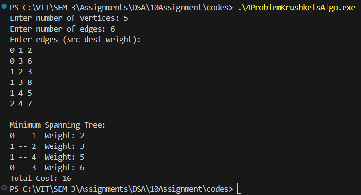

# Assignment No: 10 Problem: 4

## Title: Implementation of Kruskal’s Algorithm Using Adjacency List


### Theory

Kruskal’s Algorithm is a greedy algorithm used to find the Minimum Spanning Tree (MST) of a connected, undirected, and weighted graph. The MST connects all vertices with the minimum possible total edge weight and without forming cycles.

Steps involved:
1. Sort all edges in non-decreasing order of weight.
2. Pick the smallest edge and check if it forms a cycle using Disjoint Set Union (DSU).
3. If no cycle is formed, include it in the MST.
4. Repeat until MST contains (V – 1) edges.

Using an adjacency list, the edges are extracted, sorted, and processed through DSU.

---

### Algorithm

1. Start  
2. Input the number of vertices and edges  
3. Create an adjacency list for the graph  
4. Insert edges (u, v, w) into the adjacency list  
5. Extract all unique edges from the adjacency list  
6. Sort edge list in non-decreasing order  
7. Initialize parent and rank arrays for DSU  
8. For each edge in sorted order:  
   - Find parents of both vertices  
   - If they belong to different sets:  
     - Add edge to MST  
     - Union the sets  
9. Continue until (V − 1) edges added  
10. Display MST edges and minimum cost  
11. Stop  

---

### C++ Code

```cpp
#include <iostream>
#include <vector>
#include <algorithm>
using namespace std;

struct Edge_asr {
    int src_asr, dest_asr, weight_asr;
};

struct Node_asr {
    int dest_asr, weight_asr;
};

struct Set_asr {
    int parent_asr;
    int rank_asr;
};

int findSet_asr(vector<Set_asr> &set_asr, int v_asr) {
    if (set_asr[v_asr].parent_asr != v_asr)
        set_asr[v_asr].parent_asr = findSet_asr(set_asr, set_asr[v_asr].parent_asr);
    return set_asr[v_asr].parent_asr;
}

void unionSet_asr(vector<Set_asr> &set_asr, int u_asr, int v_asr) {
    int uRoot_asr = findSet_asr(set_asr, u_asr);
    int vRoot_asr = findSet_asr(set_asr, v_asr);

    if (set_asr[uRoot_asr].rank_asr < set_asr[vRoot_asr].rank_asr)
        set_asr[uRoot_asr].parent_asr = vRoot_asr;
    else if (set_asr[uRoot_asr].rank_asr > set_asr[vRoot_asr].rank_asr)
        set_asr[vRoot_asr].parent_asr = uRoot_asr;
    else {
        set_asr[vRoot_asr].parent_asr = uRoot_asr;
        set_asr[uRoot_asr].rank_asr++;
    }
}

int main() {
    int V_asr, E_asr;
    cout << "Enter number of vertices: ";
    cin >> V_asr;
    cout << "Enter number of edges: ";
    cin >> E_asr;

    vector<vector<Node_asr>> adjList_asr(V_asr);
    vector<Edge_asr> edges_asr;

    cout << "Enter edges (src dest weight):\n";
    for (int i = 0; i < E_asr; i++) {
        int u_asr, v_asr, w_asr;
        cin >> u_asr >> v_asr >> w_asr;

        adjList_asr[u_asr].push_back({v_asr, w_asr});
        adjList_asr[v_asr].push_back({u_asr, w_asr});

        edges_asr.push_back({u_asr, v_asr, w_asr});
    }

    sort(edges_asr.begin(), edges_asr.end(), [](Edge_asr a, Edge_asr b) {
        return a.weight_asr < b.weight_asr;
    });

    vector<Set_asr> set_asr(V_asr);
    for (int i = 0; i < V_asr; i++) {
        set_asr[i].parent_asr = i;
        set_asr[i].rank_asr = 0;
    }

    vector<Edge_asr> mst_asr;
    int totalCost_asr = 0;

    for (auto &edge_asr : edges_asr) {
        int uRoot_asr = findSet_asr(set_asr, edge_asr.src_asr);
        int vRoot_asr = findSet_asr(set_asr, edge_asr.dest_asr);

        if (uRoot_asr != vRoot_asr) {
            mst_asr.push_back(edge_asr);
            totalCost_asr += edge_asr.weight_asr;
            unionSet_asr(set_asr, uRoot_asr, vRoot_asr);
        }
    }

    cout << "\nMinimum Spanning Tree:\n";
    for (auto &edge_asr : mst_asr) {
        cout << edge_asr.src_asr << " -- " << edge_asr.dest_asr
             << "  Weight: " << edge_asr.weight_asr << endl;
    }

    cout << "Total Cost: " << totalCost_asr << endl;

    return 0;
}
```

### Output

```
Enter number of vertices: 5
Enter number of edges: 6
Enter edges (src dest weight):
0 1 2
0 3 6
1 2 3
1 3 8
1 4 5
2 4 7

Minimum Spanning Tree:
0 -- 1  Weight: 2
1 -- 2  Weight: 3
1 -- 4  Weight: 5
0 -- 3  Weight: 6
Total Cost: 16

```
