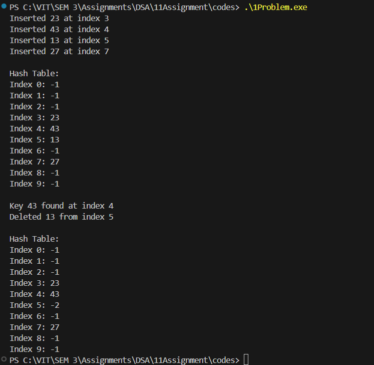

# Assignment No: 11 Problem: 1

## Title: Implement a Hash Table with Collision Resolution Using Linear Probing

### Theory

A **hash table** is a data structure that stores key–value pairs and provides efficient insertion, search, and deletion operations. The core idea behind a hash table is the use of a **hash function**, which maps keys to indices in an array.

However, different keys may generate the same hash value, leading to a **collision**.  
Collision resolution techniques are essential to handling such situations.

One commonly used technique is **Linear Probing**, where collisions are resolved by checking subsequent positions (index + 1, index + 2, …) until an empty slot is found.

### Key Features of Linear Probing

- Uses a simple and predictable probing sequence.
- Minimizes memory usage because all data is stored in the same array.
- Suffers from **primary clustering**, where long runs of occupied cells slow down operations.

### Algorithm

1. **Initialization**  
   - Define a hash table of fixed size.  
   - Initialize all table slots to a sentinel value (e.g., -1).

2. **Hash Function**  
   - Compute index = key % table_size.

3. **Insertion(key)**  
   - Compute the initial index using the hash function.  
   - If the slot is empty, insert the key.  
   - If occupied, increment the index linearly (index = (index + 1) % size) until an empty slot is found.  
   - Insert the key into the first available slot.

4. **Search(key)**  
   - Compute the index using the hash function.  
   - If key is found at that index, return success.  
   - Else, probe linearly until:  
     - The key is found, or  
     - An empty slot is encountered (key not present).

5. **Deletion(key)**  
   - Search for the key using the search method.  
   - If found, mark the position as deleted using a special marker (e.g., -2).  
   - Maintain probing continuity.

6. **Display Table**  
   - Print the contents of the hash table index-wise.

---

### C++ Code

```cpp
#include <iostream>
using namespace std;

// Structure for Hash Table
struct HashTable_asr {
    int size_asr;
    int *table_asr;
};

// Create a hash table
HashTable_asr* createTable_asr(int size_asr) {
    HashTable_asr* ht_asr = new HashTable_asr();
    ht_asr->size_asr = size_asr;
    ht_asr->table_asr = new int[size_asr];

    for (int i = 0; i < size_asr; i++) {
        ht_asr->table_asr[i] = -1; // -1 means empty
    }

    return ht_asr;
}

// Hash function
int hashFunction_asr(int key_asr, int size_asr) {
    return key_asr % size_asr;
}

// Insert using Linear Probing
void insertKey_asr(HashTable_asr* ht_asr, int key_asr) {
    int index_asr = hashFunction_asr(key_asr, ht_asr->size_asr);

    for (int i = 0; i < ht_asr->size_asr; i++) {
        int newIndex_asr = (index_asr + i) % ht_asr->size_asr;

        if (ht_asr->table_asr[newIndex_asr] == -1 || ht_asr->table_asr[newIndex_asr] == -2) {
            ht_asr->table_asr[newIndex_asr] = key_asr;
            cout << "Inserted " << key_asr << " at index " << newIndex_asr << endl;
            return;
        }
    }

    cout << "Hash Table Full! Cannot insert " << key_asr << endl;
}

// Search key
int searchKey_asr(HashTable_asr* ht_asr, int key_asr) {
    int index_asr = hashFunction_asr(key_asr, ht_asr->size_asr);

    for (int i = 0; i < ht_asr->size_asr; i++) {
        int newIndex_asr = (index_asr + i) % ht_asr->size_asr;

        if (ht_asr->table_asr[newIndex_asr] == key_asr)
            return newIndex_asr;

        if (ht_asr->table_asr[newIndex_asr] == -1)
            return -1;
    }

    return -1;
}

// Delete key
void deleteKey_asr(HashTable_asr* ht_asr, int key_asr) {
    int index_asr = searchKey_asr(ht_asr, key_asr);

    if (index_asr == -1) {
        cout << "Key " << key_asr << " not found!" << endl;
    } else {
        ht_asr->table_asr[index_asr] = -2; // -2 marks deleted
        cout << "Deleted " << key_asr << " from index " << index_asr << endl;
    }
}

// Display table
void displayTable_asr(HashTable_asr* ht_asr) {
    cout << "\nHash Table:\n";
    for (int i = 0; i < ht_asr->size_asr; i++) {
        cout << "Index " << i << ": " << ht_asr->table_asr[i] << endl;
    }
}

// Main function
int main() {
    HashTable_asr* ht_asr = createTable_asr(10);

    insertKey_asr(ht_asr, 23);
    insertKey_asr(ht_asr, 43);
    insertKey_asr(ht_asr, 13);
    insertKey_asr(ht_asr, 27);

    displayTable_asr(ht_asr);

    int search_asr = 43;
    int pos_asr = searchKey_asr(ht_asr, search_asr);
    if (pos_asr != -1)
        cout << "\nKey " << search_asr << " found at index " << pos_asr << endl;
    else
        cout << "\nKey " << search_asr << " not found!" << endl;

    deleteKey_asr(ht_asr, 13);
    displayTable_asr(ht_asr);

    return 0;
}
```

### Output

```
Inserted 23 at index 3
Inserted 43 at index 4
Inserted 13 at index 5
Inserted 27 at index 7

Hash Table:
Index 0: -1
Index 1: -1
Index 2: -1
Index 3: 23
Index 4: 43
Index 5: 13
Index 6: -1
Index 7: 27
Index 8: -1
Index 9: -1

Key 43 found at index 4
Deleted 13 from index 5

Hash Table:
Index 0: -1
Index 1: -1
Index 2: -1
Index 3: 23
Index 5: 13
Index 6: -1
Index 7: 27
Index 8: -1
Index 9: -1

```
