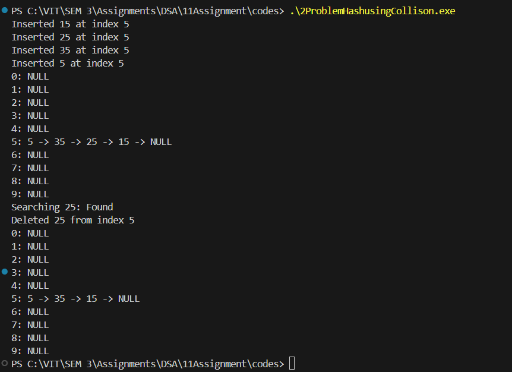

# Assignment No: 11 Problem: 2

## Title: Implement Collision Handling Using Separate Chaining

### Theory
Separate chaining is a collision-handling technique used in hash tables.  
When two or more keys hash to the same index, instead of overwriting or probing for another spot, **linked lists** are used at each index of the hash table.  
Each element in the hash table index points to the head of a linked list, and new elements are inserted into this list.

**Key Points:**
- Each index of the hash table stores a pointer to a linked list.
- When a collision occurs, the new element is appended or inserted into the list.
- Searching involves traversing the list at the hashed index.
- Deletion requires locating the node in the list and updating pointers.
- Separate chaining prevents cluster formation and gives efficient average-case performance.

### Algorithm
1. Initialize a hash table of fixed size with all indices set to NULL.  
2. **Hash Function(key)**:  
   - Compute `index = key % table_size`.
3. **Insert(key)**:  
   - Compute index using the hash function.  
   - Create a new node containing the key.  
   - Insert the node at the beginning of the linked list at this index.  
4. **Search(key)**:  
   - Compute the index.  
   - Traverse the linked list at this index.  
   - If key is found, return success; otherwise return failure.  
5. **Delete(key)**:  
   - Compute the index.  
   - Traverse the linked list at that index.  
   - If key is found, adjust pointers to remove the node and free memory.  
6. **Display()**:  
   - For each index, traverse and print the corresponding linked list.

---

### C++ Code
```cpp
#include <iostream>
using namespace std;

// Node structure for separate chaining
struct Node_asr {
    int data_asr;
    Node_asr* next_asr;
};

// Hash table size
const int TABLE_SIZE_asr = 10;

// Hash table array
Node_asr* hashTable_asr[TABLE_SIZE_asr];

// Hash function
int hashFunction_asr(int key_asr) {
    return key_asr % TABLE_SIZE_asr;
}

// Insert key
void insertKey_asr(int key_asr) {
    int index_asr = hashFunction_asr(key_asr);

    Node_asr* newNode_asr = new Node_asr();
    newNode_asr->data_asr = key_asr;
    newNode_asr->next_asr = hashTable_asr[index_asr];

    hashTable_asr[index_asr] = newNode_asr;

    cout << "Inserted " << key_asr << " at index " << index_asr << endl;
}

// Search key
bool searchKey_asr(int key_asr) {
    int index_asr = hashFunction_asr(key_asr);
    Node_asr* temp_asr = hashTable_asr[index_asr];

    while (temp_asr != nullptr) {
        if (temp_asr->data_asr == key_asr)
            return true;
        temp_asr = temp_asr->next_asr;
    }
    return false;
}

// Delete key
void deleteKey_asr(int key_asr) {
    int index_asr = hashFunction_asr(key_asr);
    Node_asr* temp_asr = hashTable_asr[index_asr];
    Node_asr* prev_asr = nullptr;

    while (temp_asr != nullptr) {
        if (temp_asr->data_asr == key_asr) {
            if (prev_asr == nullptr)
                hashTable_asr[index_asr] = temp_asr->next_asr;
            else
                prev_asr->next_asr = temp_asr->next_asr;

            delete temp_asr;
            cout << "Deleted " << key_asr << " from index " << index_asr << endl;
            return;
        }
        prev_asr = temp_asr;
        temp_asr = temp_asr->next_asr;
    }

    cout << "Key " << key_asr << " not found!" << endl;
}

// Display hash table
void displayTable_asr() {
    for (int i_asr = 0; i_asr < TABLE_SIZE_asr; i_asr++) {
        cout << i_asr << ": ";
        Node_asr* temp_asr = hashTable_asr[i_asr];
        while (temp_asr != nullptr) {
            cout << temp_asr->data_asr << " -> ";
            temp_asr = temp_asr->next_asr;
        }
        cout << "NULL" << endl;
    }
}

int main() {
    for (int i = 0; i < TABLE_SIZE_asr; i++)
        hashTable_asr[i] = nullptr;

    insertKey_asr(15);
    insertKey_asr(25);
    insertKey_asr(35);
    insertKey_asr(5);

    displayTable_asr();

    cout << "Searching 25: " << (searchKey_asr(25) ? "Found" : "Not Found") << endl;

    deleteKey_asr(25);
    displayTable_asr();

    return 0;
}
```

### Output

```
Inserted 15 at index 5
Inserted 25 at index 5
Inserted 35 at index 5
Inserted 5 at index 5
0: NULL
1: NULL
2: NULL
3: NULL
4: NULL
5: 5 -> 35 -> 25 -> 15 -> NULL
6: NULL
7: NULL
8: NULL
9: NULL
Searching 25: Found
Deleted 25 from index 5
0: NULL
1: NULL
2: NULL
3: NULL
4: NULL
5: 5 -> 35 -> 15 -> NULL
6: NULL
7: NULL
8: NULL
9: NULL

```
