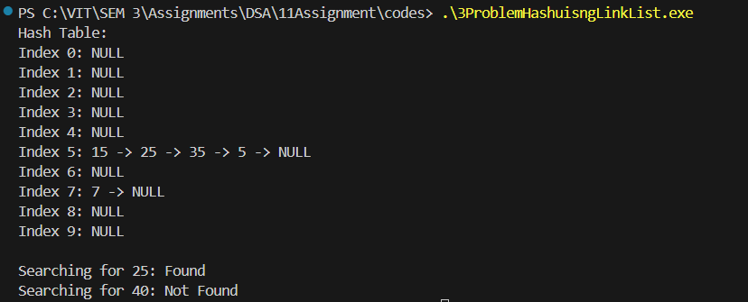

# Assignment No: 11 Problem: 3

## Title: Implement Collision Resolution Using Linked Lists
## Theory

Hashing is a technique used to map a large set of data to a smaller table of fixed size, called a hash table.  
A hash function is used to compute an index (hash value) where the key-value pair should be stored.  
However, different keys may produce the same hash value — this situation is called a **collision**.

To handle collisions, several techniques exist. One of the most common is **Separate Chaining**, where each index of the hash table stores a **linked list** of elements that hash to the same index. If multiple elements collide, they are appended to the linked list at that index.

Advantages of Separate Chaining:
- Simple to implement
- Hash table never fills up completely
- Efficient when load factor is reasonable

---

## Algorithm

### Algorithm for Inserting a Key
1. Compute the hash index using the hash function.  
2. Check if the hash table index is empty.  
3. If empty, create a new node and store it there.  
4. If not empty, traverse the linked list at that index.  
5. Insert the new key at the end of the linked list.  

### Algorithm for Searching a Key
1. Compute the hash index using the hash function.  
2. Traverse the linked list at that index.  
3. If the key is found, return its position.  
4. If the linked list ends, return “Not Found”.  

### Algorithm for Displaying the Hash Table
1. For each index in the hash table:  
   - Print the index number  
   - Traverse and print all nodes in the linked list  

---

## C++ Code

```cpp
#include <iostream>
using namespace std;

// Node structure for linked list
struct Node_asr {
    int data_asr;
    Node_asr* next_asr;
};

// Hash table size
const int TABLE_SIZE_asr = 10;

// Hash table array of pointers
Node_asr* hashTable_asr[TABLE_SIZE_asr];

// Hash function
int hashFunction_asr(int key_asr) {
    return key_asr % TABLE_SIZE_asr;
}

// Insert key into hash table
void insertKey_asr(int key_asr) {
    int index_asr = hashFunction_asr(key_asr);

    Node_asr* newNode_asr = new Node_asr();
    newNode_asr->data_asr = key_asr;
    newNode_asr->next_asr = nullptr;

    if (hashTable_asr[index_asr] == nullptr) {
        hashTable_asr[index_asr] = newNode_asr;
    } else {
        Node_asr* temp_asr = hashTable_asr[index_asr];
        while (temp_asr->next_asr != nullptr) {
            temp_asr = temp_asr->next_asr;
        }
        temp_asr->next_asr = newNode_asr;
    }
}

// Search key in hash table
bool searchKey_asr(int key_asr) {
    int index_asr = hashFunction_asr(key_asr);
    Node_asr* temp_asr = hashTable_asr[index_asr];

    while (temp_asr != nullptr) {
        if (temp_asr->data_asr == key_asr)
            return true;
        temp_asr = temp_asr->next_asr;
    }
    return false;
}

// Display hash table
void displayTable_asr() {
    for (int i = 0; i < TABLE_SIZE_asr; i++) {
        cout << "Index " << i << ": ";
        Node_asr* temp_asr = hashTable_asr[i];
        while (temp_asr != nullptr) {
            cout << temp_asr->data_asr << " -> ";
            temp_asr = temp_asr->next_asr;
        }
        cout << "NULL\n";
    }
}

// Main function
int main() {
    // Initialize hash table
    for (int i = 0; i < TABLE_SIZE_asr; i++) {
        hashTable_asr[i] = nullptr;
    }

    insertKey_asr(15);
    insertKey_asr(25);
    insertKey_asr(35);
    insertKey_asr(5);
    insertKey_asr(7);

    cout << "Hash Table:\n";
    displayTable_asr();

    cout << "\nSearching for 25: " 
         << (searchKey_asr(25) ? "Found" : "Not Found") << endl;

    cout << "Searching for 40: " 
         << (searchKey_asr(40) ? "Found" : "Not Found") << endl;

    return 0;
}
```

### Output

```
Hash Table:
Index 0: NULL
Index 1: NULL
Index 2: NULL
Index 3: NULL
Index 4: NULL
Index 5: 15 -> 25 -> 35 -> 5 -> NULL
Index 6: NULL
Index 7: 7 -> NULL
Index 8: NULL
Index 9: NULL

Searching for 25: Found
Searching for 40: Not Found

```
