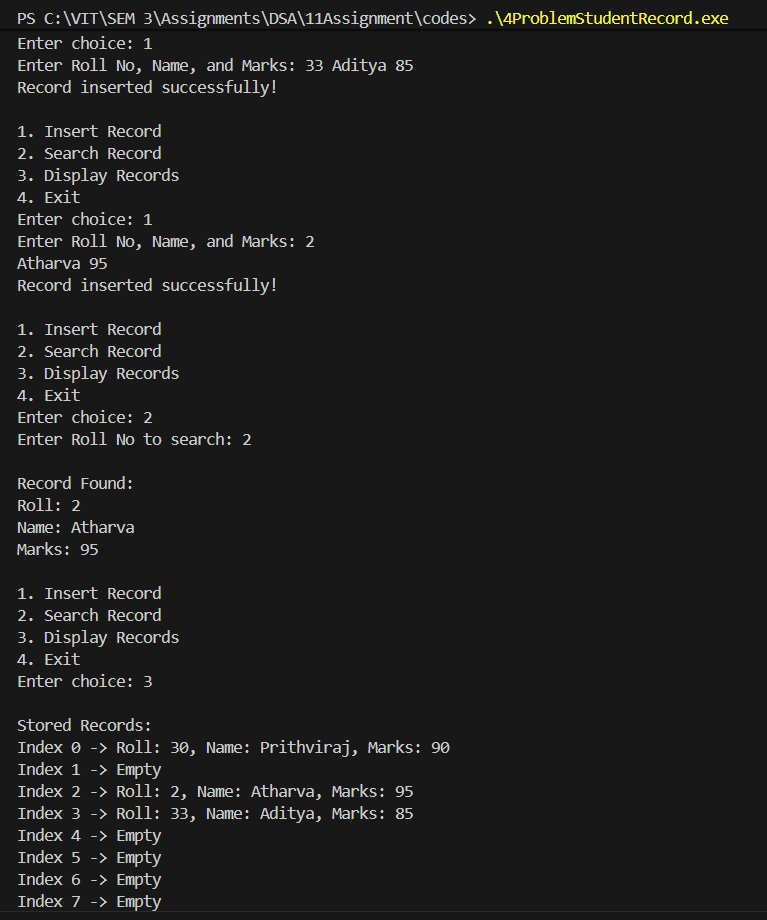

# Assignment No: 11 Problem: 4

## Title: Store and Retrieve Student Records Using Roll Numbers (Hashing with Linear Probing)
## Theory

Hashing is an efficient technique used to store and retrieve data in constant time on average.  
It uses a **hash function** that maps a key (here, roll number) to an index in a hash table.

In this assignment:

- Each student record contains **roll number, name, and marks**.
- A hash table of fixed size is used.
- The hash function used is:

```
hash = roll % SIZE
```

- **Linear probing** is used for collision resolution:
  - If the calculated index is occupied, we move sequentially to the next index.
  - This continues until an empty slot is found.
- Searching also uses the same probing sequence.
- This ensures efficient insertion and retrieval in most cases.

---

## Algorithm

### **Algorithm: Insert a Student Record**
1. Input roll, name, and marks.  
2. Compute index = roll % SIZE.  
3. If the position is empty, store the record.  
4. If not empty (collision):  
   - Move to the next index (linear probing).  
   - Repeat until an empty slot is found or table becomes full.  
5. Display "Record inserted successfully".

---

### **Algorithm: Search a Student Record**
1. Input roll number to search.  
2. Compute index = roll % SIZE.  
3. If the record at index matches the roll number, display it.  
4. Otherwise, linearly probe to next index.  
5. Stop if:  
   - Record is found, or  
   - All positions are checked.  
6. If not found, display "Record not found".

---

### **Algorithm: Display All Records**
1. Traverse the hash table from index 0 to SIZE−1.  
2. If the slot contains a record, display Roll, Name, Marks.  
3. Otherwise, show "Empty".  

---

## C++ Code

```cpp
#include <iostream>
#include <string>
using namespace std;

const int SIZE_asr = 10;

// Structure to store student data
struct Student_asr {
    int roll_asr;
    string name_asr;
    float marks_asr;
    bool occupied_asr;
};

// Hash table implemented using struct (no classes)
struct HashTable_asr {
    Student_asr table_asr[SIZE_asr];

    // Initialize table
    void init_asr() {
        for (int i = 0; i < SIZE_asr; i++)
            table_asr[i].occupied_asr = false;
    }

    // Hash function
    int hashFunction_asr(int roll_asr) {
        return roll_asr % SIZE_asr;
    }

    // Insert record using linear probing
    void insertRecord_asr(int roll_asr, string name_asr, float marks_asr) {
        int index_asr = hashFunction_asr(roll_asr);
        int startIndex_asr = index_asr;

        while (table_asr[index_asr].occupied_asr) {
            index_asr = (index_asr + 1) % SIZE_asr;
            if (index_asr == startIndex_asr) {
                cout << "Hash table is full!" << endl;
                return;
            }
        }

        table_asr[index_asr].roll_asr = roll_asr;
        table_asr[index_asr].name_asr = name_asr;
        table_asr[index_asr].marks_asr = marks_asr;
        table_asr[index_asr].occupied_asr = true;

        cout << "Record inserted successfully!" << endl;
    }

    // Search record
    void searchRecord_asr(int roll_asr) {
        int index_asr = hashFunction_asr(roll_asr);
        int startIndex_asr = index_asr;

        while (table_asr[index_asr].occupied_asr) {
            if (table_asr[index_asr].roll_asr == roll_asr) {
                cout << "\nRecord Found:\n";
                cout << "Roll: " << table_asr[index_asr].roll_asr
                     << "\nName: " << table_asr[index_asr].name_asr
                     << "\nMarks: " << table_asr[index_asr].marks_asr << endl;
                return;
            }
            index_asr = (index_asr + 1) % SIZE_asr;
            if (index_asr == startIndex_asr)
                break;
        }

        cout << "Record not found!" << endl;
    }

    // Display all records
    void display_asr() {
        cout << "\nStored Records:\n";
        for (int i = 0; i < SIZE_asr; i++) {
            if (table_asr[i].occupied_asr) {
                cout << "Index " << i
                     << " -> Roll: " << table_asr[i].roll_asr
                     << ", Name: " << table_asr[i].name_asr
                     << ", Marks: " << table_asr[i].marks_asr << endl;
            } else {
                cout << "Index " << i << " -> Empty\n";
            }
        }
    }
};

int main() {
    HashTable_asr ht_asr;
    ht_asr.init_asr();

    int choice_asr;

    while (true) {
        cout << "\n1. Insert Record\n2. Search Record\n3. Display Records\n4. Exit\nEnter choice: ";
        cin >> choice_asr;

        if (choice_asr == 1) {
            int roll_asr;
            string name_asr;
            float marks_asr;
            cout << "Enter Roll No, Name, and Marks: ";
            cin >> roll_asr >> name_asr >> marks_asr;
            ht_asr.insertRecord_asr(roll_asr, name_asr, marks_asr);
        }
        else if (choice_asr == 2) {
            int roll_asr;
            cout << "Enter Roll No to search: ";
            cin >> roll_asr;
            ht_asr.searchRecord_asr(roll_asr);
        }
        else if (choice_asr == 3) {
            ht_asr.display_asr();
        }
        else if (choice_asr == 4) {
            break;
        }
        else {
            cout << "Invalid choice!" << endl;
        }
    }

    return 0;
}
```

---

## Output

```
1. Insert Record
2. Search Record
3. Display Records
4. Exit
Enter choice: 1
Enter Roll No, Name, and Marks: 30 Prithviraj 90
Record inserted successfully!

1. Insert Record
2. Search Record
3. Display Records
4. Exit
Enter choice: 1
Enter Roll No, Name, and Marks: 33 Aditya 85
Record inserted successfully!

1. Insert Record
2. Search Record
3. Display Records
4. Exit
Enter choice: 1
Enter Roll No, Name, and Marks: 02 Ganesh 92
Record inserted successfully!

1. Insert Record
2. Search Record
3. Display Records
4. Exit
Enter choice: 2
Enter Roll No to search: 02

Record Found:
Roll: 2
Name: Ganesh
Marks: 92

1. Insert Record
2. Search Record
3. Display Records
4. Exit
Enter choice: 3

Stored Records:
Index 0 -> Roll: 30, Name: Prithviraj, Marks: 90
Index 1 -> Empty
Index 2 -> Roll: 2, Name: Ganesh, Marks: 92
Index 3 -> Roll: 33, Name: Aditya, Marks: 85
Index 4 -> Empty
Index 5 -> Empty
Index 6 -> Empty
Index 7 -> Empty
Index 8 -> Empty
Index 9 -> Empty

1. Insert Record
2. Search Record
3. Display Records
4. Exit
Enter choice: 4
```

