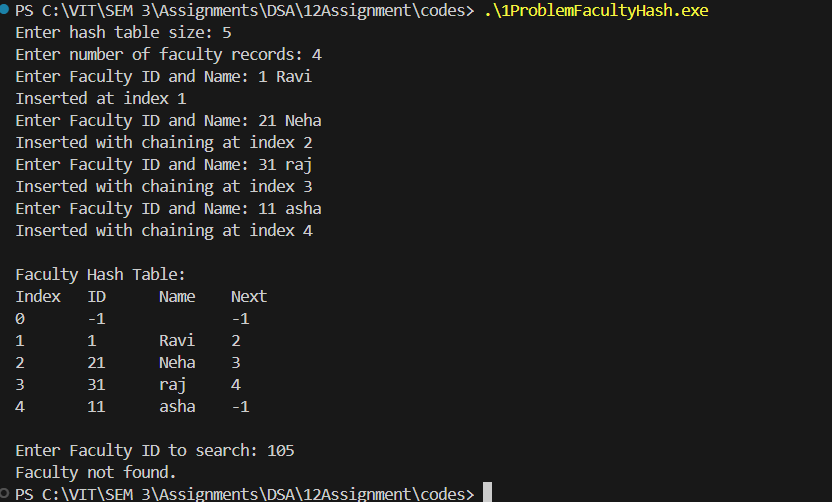

# Assignment No: 12 Problem: 1

## Title: Simulation of Faculty Database Using Hash Table (Linear Probing with Chaining Without Replacement)

## Theory
A hash table is a data structure that stores data in an array format, where each data record is mapped to an index using a hash function. The divide method is used as a hash function:

`hash(key) = key % tableSize`

### Collision Handling  
This assignment uses:

### Linear Probing with Chaining Without Replacement
- Linear probing finds the next available empty slot.
- Chaining without replacement stores a linked chain using `next` pointers.
- Each record contains: ID, name, and the index of the next record in the chain.

This ensures fast search, insertion, and traversal.

---

## Algorithm

### Insert Faculty(key, name)
1. Compute index = key % size  
2. If table[index] is empty, insert record  
3. Else traverse chain to reach last node  
4. Search linearly for an empty slot  
5. If table is full, print error  
6. Insert record in empty slot  
7. Update previous node’s next pointer  

### Search Faculty(key)
1. Compute index = key % size  
2. Traverse chain using next pointers  
3. If key matches, display details  
4. If chain ends, print “Not found”  

### Display Table
1. Print index, ID, Name, Next for each table slot  

---

## C++ Code

```cpp
#include <iostream>
#include <string>
#include <vector>
using namespace std;

struct Faculty_asr {
    int id_asr;
    string name_asr;
    int next_asr;

    Faculty_asr() {
        id_asr = -1;
        name_asr = "";
        next_asr = -1;
    }
};

vector<Faculty_asr> table_asr;
int size_asr;

int hashFunction_asr(int key_asr) {
    return key_asr % size_asr;
}

void insertFaculty_asr(int id_asr, string name_asr) {
    int index_asr = hashFunction_asr(id_asr);

    if (table_asr[index_asr].id_asr == -1) {
        table_asr[index_asr].id_asr = id_asr;
        table_asr[index_asr].name_asr = name_asr;
        cout << "Inserted at index " << index_asr << endl;
        return;
    }

    int tempIndex_asr = index_asr;

    while (table_asr[tempIndex_asr].next_asr != -1) {
        tempIndex_asr = table_asr[tempIndex_asr].next_asr;
    }

    int newIndex_asr = (tempIndex_asr + 1) % size_asr;

    while (table_asr[newIndex_asr].id_asr != -1 && newIndex_asr != index_asr) {
        newIndex_asr = (newIndex_asr + 1) % size_asr;
    }

    if (newIndex_asr == index_asr) {
        cout << "Hash table is full. Cannot insert record." << endl;
        return;
    }

    table_asr[newIndex_asr].id_asr = id_asr;
    table_asr[newIndex_asr].name_asr = name_asr;
    table_asr[tempIndex_asr].next_asr = newIndex_asr;

    cout << "Inserted with chaining at index " << newIndex_asr << endl;
}

void searchFaculty_asr(int id_asr) {
    int index_asr = hashFunction_asr(id_asr);

    while (index_asr != -1) {
        if (table_asr[index_asr].id_asr == id_asr) {
            cout << "Faculty found: " << table_asr[index_asr].name_asr
                 << " at index " << index_asr << endl;
            return;
        }
        index_asr = table_asr[index_asr].next_asr;
    }

    cout << "Faculty not found.";
}

void displayTable_asr() {
    cout << "\nFaculty Hash Table:\n";
    cout << "Index\tID\tName\tNext\n";
    for (int i = 0; i < size_asr; i++) {
        cout << i << "\t" << table_asr[i].id_asr << "\t"
             << table_asr[i].name_asr << "\t" << table_asr[i].next_asr << endl;
    }
}

int main() {
    cout << "Enter hash table size: ";
    cin >> size_asr;

    table_asr.resize(size_asr);

    int n_asr;
    cout << "Enter number of faculty records: ";
    cin >> n_asr;

    for (int i = 0; i < n_asr; i++) {
        int id_asr;
        string name_asr;
        cout << "Enter Faculty ID and Name: ";
        cin >> id_asr >> name_asr;
        insertFaculty_asr(id_asr, name_asr);
    }

    displayTable_asr();

    int searchID_asr;
    cout << "\nEnter Faculty ID to search: ";
    cin >> searchID_asr;
    searchFaculty_asr(searchID_asr);

    return 0;
}
```

### Output

```
Enter hash table size: 5
Enter number of faculty records: 4
Enter Faculty ID and Name: 101 Paras
Inserted at index 1
Enter Faculty ID and Name: 109
Tiwari
Inserted at index 4
Enter Faculty ID and Name: 156
Pawar
Inserted with chaining at index 2
Enter Faculty ID and Name: 104
Hatigine
Inserted with chaining at index 0

Faculty Hash Table:
Index   ID      Name    Next
0       104     Hatigine        -1
1       101     Paras   2
2       156     Pawar   -1
3       -1              -1
4       109     Tiwari  0

Enter Faculty ID to search: 102
Faculty not found.
```
