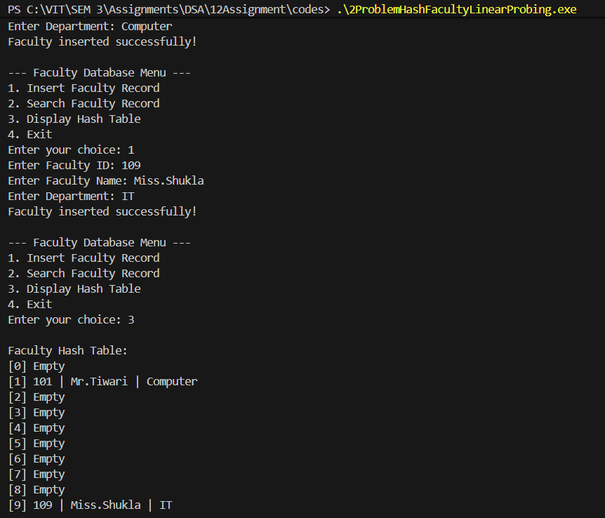

# Assignment No: 12 Problem: 2

## Title: Simulation of Faculty Database Using Hash Table with Linear Probing and Chaining with Replacement


## Theory

A **hash table** is a data structure used for efficient insertion, searching, and deletion of records. It uses a **hash function** to compute an index at which the record should ideally be placed. In this assignment, we use:

### **1. Hash Function**
The hash function used is:

```
index = key % SIZE
```

This distributes the faculty records across the hash table.

### **2. Collision Handling**
Collisions occur when two records produce the same hash index. In this implementation, two methods are used:

#### **a. Linear Probing**
If the calculated index is occupied, the next available slot is searched sequentially until an empty position is found.

#### **b. Chaining with Replacement**
If a record already in the slot does *not* belong to that hash location (i.e., its correct hash index differs), it is **replaced**, and the displaced record is reinserted into the appropriate position.

### **3. Faculty Record Structure**
Each faculty record includes:
- Faculty ID  
- Faculty Name  
- Department  
- Occupied flag (to indicate if slot is used)

### **4. Supported Operations**
- Insert a faculty record  
- Search a faculty record by ID  
- Display the entire hash table  

This assignment demonstrates how hashing improves search efficiency compared to linear data structures.

---

## Algorithm

### **Algorithm: Insert Faculty Record**

1. Read `id`, `name`, and `department`.  
2. Compute `index = id % SIZE`.  
3. If slot at `index` is empty, insert record and stop.  
4. Otherwise:
   - Compute `existing_hash` of the record at that index.  
   - If `existing_hash != index`, then:
     - Replace the existing record with the new one.
     - Reinsert the displaced record using the same insertion procedure.
   - Else:
     - Perform linear probing until an empty slot is found.
5. Insert the new record in the found slot.

---

### **Algorithm: Search Faculty Record**

1. Compute `index = id % SIZE`.  
2. Starting at this index, check records sequentially:  
   - If slot matches the ID, display it and stop.  
   - Continue probing until returning to start index.  
3. If ID is not found, display *Faculty not found*.

---

### **Algorithm: Display Hash Table**

1. Traverse hash table from index `0` to `SIZE - 1`.  
2. For each slot:
   - If occupied, print ID, name, and department.  
   - Otherwise print "Empty".

---

## C++ Code

```cpp
#include <iostream>
#include <string>
using namespace std;

struct Faculty_asr {
    int id_asr;
    string name_asr;
    string dept_asr;
    bool occupied_asr;
};

struct FacultyHashTable_asr {
    static const int SIZE_asr = 10;
    Faculty_asr table_asr[SIZE_asr];

    FacultyHashTable_asr() {
        for (int i = 0; i < SIZE_asr; i++)
            table_asr[i].occupied_asr = false;
    }

    int hashFunction_asr(int key_asr) {
        return key_asr % SIZE_asr;
    }

    void insertFaculty_asr(int id_asr, string name_asr, string dept_asr) {
        int index_asr = hashFunction_asr(id_asr);

        if (!table_asr[index_asr].occupied_asr) {
            table_asr[index_asr] = {id_asr, name_asr, dept_asr, true};
            cout << "Faculty inserted successfully!\n";
            return;
        }

        int existingHash_asr = hashFunction_asr(table_asr[index_asr].id_asr);

        if (existingHash_asr != index_asr) {
            cout << "Collision! Applying chaining with replacement.\n";
            Faculty_asr temp_asr = table_asr[index_asr];
            table_asr[index_asr] = {id_asr, name_asr, dept_asr, true};
            insertFaculty_asr(temp_asr.id_asr, temp_asr.name_asr, temp_asr.dept_asr);
        } 
        else {
            int start_asr = index_asr;
            do {
                index_asr = (index_asr + 1) % SIZE_asr;
                if (!table_asr[index_asr].occupied_asr) {
                    table_asr[index_asr] = {id_asr, name_asr, dept_asr, true};
                    cout << "Faculty inserted successfully!\n";
                    return;
                }
            } while (index_asr != start_asr);

            cout << "Hash table is full. Cannot insert record.\n";
        }
    }

    void searchFaculty_asr(int id_asr) {
        int index_asr = hashFunction_asr(id_asr);
        int start_asr = index_asr;

        while (table_asr[index_asr].occupied_asr) {
            if (table_asr[index_asr].id_asr == id_asr) {
                cout << "\nFaculty Found:\n";
                cout << "ID: " << table_asr[index_asr].id_asr << endl;
                cout << "Name: " << table_asr[index_asr].name_asr << endl;
                cout << "Department: " << table_asr[index_asr].dept_asr << endl;
                return;
            }
            index_asr = (index_asr + 1) % SIZE_asr;
            if (index_asr == start_asr) break;
        }

        cout << "Faculty not found!\n";
    }

    void displayTable_asr() {
        cout << "\nFaculty Hash Table:\n";
        for (int i = 0; i < SIZE_asr; i++) {
            if (table_asr[i].occupied_asr)
                cout << "[" << i << "] " << table_asr[i].id_asr << " | "
                     << table_asr[i].name_asr << " | "
                     << table_asr[i].dept_asr << endl;
            else
                cout << "[" << i << "] Empty\n";
        }
    }
};

int main() {
    FacultyHashTable_asr hashTable_asr;
    int choice_asr, id_asr;
    string name_asr, dept_asr;

    while (true) {
        cout << "\n--- Faculty Database Menu ---\n";
        cout << "1. Insert Faculty Record\n";
        cout << "2. Search Faculty Record\n";
        cout << "3. Display Hash Table\n";
        cout << "4. Exit\n";
        cout << "Enter your choice: ";
        cin >> choice_asr;

        switch (choice_asr) {
        case 1:
            cout << "Enter Faculty ID: ";
            cin >> id_asr;
            cout << "Enter Faculty Name: ";
            cin >> name_asr;
            cout << "Enter Department: ";
            cin >> dept_asr;
            hashTable_asr.insertFaculty_asr(id_asr, name_asr, dept_asr);
            break;

        case 2:
            cout << "Enter Faculty ID to search: ";
            cin >> id_asr;
            hashTable_asr.searchFaculty_asr(id_asr);
            break;

        case 3:
            hashTable_asr.displayTable_asr();
            break;

        case 4:
            return 0;

        default:
            cout << "Invalid choice! Try again.\n";
        }
    }
}
```

---

## Output

```
--- Faculty Database Menu ---
1. Insert Faculty Record
2. Search Faculty Record
3. Display Hash Table
4. Exit
Enter your choice: 1
Enter Faculty ID: 101
Enter Faculty Name: Mr.Tiwari
Enter Department: Computer
Faculty inserted successfully!

--- Faculty Database Menu ---
1. Insert Faculty Record
2. Search Faculty Record
3. Display Hash Table
4. Exit
Enter your choice: 1
Enter Faculty ID: 109
Enter Faculty Name: Miss.Shukla
Enter Department: IT
Faculty inserted successfully!

--- Faculty Database Menu ---
1. Insert Faculty Record
2. Search Faculty Record
3. Display Hash Table
4. Exit
Enter your choice: 3

Faculty Hash Table:
[0] Empty
[1] 101 | Mr.Tiwari | Computer
[2] Empty
[3] Empty
[4] Empty
[5] Empty
[6] Empty
[7] Empty
[8] Empty
[9] 109 | Miss.Shukla | IT

--- Faculty Database Menu ---
1. Insert Faculty Record
2. Search Faculty Record
3. Display Hash Table
4. Exit
Enter your choice: 3

Faculty Hash Table:
[0] Empty
[1] 101 | Mr.Tiwari | Computer
[2] Empty
[3] Empty
[4] Empty
[5] Empty
[6] Empty
[7] Empty
[8] Empty
[9] 109 | Miss.Shukla | IT

--- Faculty Database Menu ---
1. Insert Faculty Record
2. Search Faculty Record
3. Display Hash Table
4. Exit
Enter your choice: 2  
Enter Faculty ID to search: 109

Faculty Found:
ID: 109
Name: Miss.Shukla
Department: IT

--- Faculty Database Menu ---
1. Insert Faculty Record
2. Search Faculty Record
3. Display Hash Table
4. Exit
Enter your choice: 4
```

