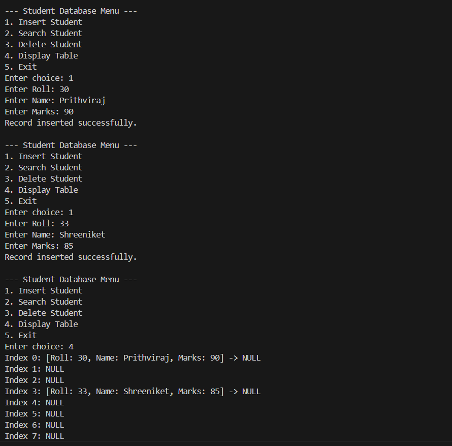

# Assignment No: 12 Problem: 4

## Title: Student Database Simulation Using Hash Table

### Theory
A hash table is a data structure used to store key–value pairs and provides efficient insertion, search, and deletion operations. It uses a hash function to compute an index for each key, determining where the corresponding value should be stored in an array.

In a student database system, hashing enables fast retrieval of student records using keys such as roll numbers. Collisions—when two keys hash to the same index—can be handled using chaining. Chaining uses linked lists at each index to store multiple records.

This assignment implements a student database using hashing and separate chaining. Each record contains the student’s name and marks. Operations supported include:

- Insertion of a new student record  
- Searching for a student by roll number  
- Deleting a student record  
- Displaying the entire hash table  

The implementation uses **structures**, **linked lists**, and a hash function to store records efficiently.

### Algorithm
1. Start  
2. Define a structure for student records containing:  
   - Roll number  
   - Name  
   - Marks  
   - Pointer to the next node  
3. Define a hash table as an array of pointers representing buckets.  
4. Initialize all buckets to NULL.  
5. **Insertion Operation**  
   1. Read student details.  
   2. Compute index = roll_number % table_size  
   3. Create a new node.  
   4. Insert node at beginning of linked list at that index.  
6. **Search Operation**  
   1. Read roll number.  
   2. Compute index.  
   3. Traverse list at that index.  
   4. If match found, display details; else print not found.  
7. **Delete Operation**  
   1. Read roll number.  
   2. Compute index.  
   3. Traverse list maintaining previous pointer.  
   4. If found, delete node and fix pointers.  
8. **Display Operation**  
   1. For each table index, traverse and print all nodes.  
9. Stop  

### C++ Code
```cpp
#include <iostream>
#include <string>
using namespace std;

struct Student_asr {
    int roll_asr;
    string name_asr;
    int marks_asr;
    Student_asr* next_asr;
};

const int TABLE_SIZE_asr = 10;
Student_asr* hashTable_asr[TABLE_SIZE_asr];

void initTable_asr() {
    for (int i = 0; i < TABLE_SIZE_asr; i++) {
        hashTable_asr[i] = nullptr;
    }
}

int hashFunction_asr(int roll_asr) {
    return roll_asr % TABLE_SIZE_asr;
}

void insertStudent_asr(int roll_asr, string name_asr, int marks_asr) {
    int index_asr = hashFunction_asr(roll_asr);

    Student_asr* newNode_asr = new Student_asr();
    newNode_asr->roll_asr = roll_asr;
    newNode_asr->name_asr = name_asr;
    newNode_asr->marks_asr = marks_asr;
    newNode_asr->next_asr = hashTable_asr[index_asr];

    hashTable_asr[index_asr] = newNode_asr;

    cout << "Record inserted successfully.\n";
}

void searchStudent_asr(int roll_asr) {
    int index_asr = hashFunction_asr(roll_asr);
    Student_asr* temp_asr = hashTable_asr[index_asr];

    while (temp_asr != nullptr) {
        if (temp_asr->roll_asr == roll_asr) {
            cout << "Record Found!\n";
            cout << "Roll: " << temp_asr->roll_asr << "\nName: " << temp_asr->name_asr
                 << "\nMarks: " << temp_asr->marks_asr << endl;
            return;
        }
        temp_asr = temp_asr->next_asr;
    }
    cout << "Record Not Found.\n";
}

void deleteStudent_asr(int roll_asr) {
    int index_asr = hashFunction_asr(roll_asr);
    Student_asr* temp_asr = hashTable_asr[index_asr];
    Student_asr* prev_asr = nullptr;

    while (temp_asr != nullptr) {
        if (temp_asr->roll_asr == roll_asr) {
            if (prev_asr == nullptr)
                hashTable_asr[index_asr] = temp_asr->next_asr;
            else
                prev_asr->next_asr = temp_asr->next_asr;

            delete temp_asr;
            cout << "Record deleted successfully.\n";
            return;
        }
        prev_asr = temp_asr;
        temp_asr = temp_asr->next_asr;
    }
    cout << "Record Not Found.\n";
}

void displayTable_asr() {
    for (int i = 0; i < TABLE_SIZE_asr; i++) {
        cout << "Index " << i << ": ";
        Student_asr* temp_asr = hashTable_asr[i];
        while (temp_asr != nullptr) {
            cout << "[Roll: " << temp_asr->roll_asr 
                 << ", Name: " << temp_asr->name_asr
                 << ", Marks: " << temp_asr->marks_asr << "] -> ";
            temp_asr = temp_asr->next_asr;
        }
        cout << "NULL\n";
    }
}

int main() {
    initTable_asr();
    int choice_asr, roll_asr, marks_asr;
    string name_asr;

    while (true) {
        cout << "\n--- Student Database Menu ---\n";
        cout << "1. Insert Student\n2. Search Student\n3. Delete Student\n4. Display Table\n5. Exit\n";
        cout << "Enter choice: ";
        cin >> choice_asr;

        switch (choice_asr) {
            case 1:
                cout << "Enter Roll: ";
                cin >> roll_asr;
                cout << "Enter Name: ";
                cin >> name_asr;
                cout << "Enter Marks: ";
                cin >> marks_asr;
                insertStudent_asr(roll_asr, name_asr, marks_asr);
                break;

            case 2:
                cout << "Enter Roll to Search: ";
                cin >> roll_asr;
                searchStudent_asr(roll_asr);
                break;

            case 3:
                cout << "Enter Roll to Delete: ";
                cin >> roll_asr;
                deleteStudent_asr(roll_asr);
                break;

            case 4:
                displayTable_asr();
                break;

            case 5:
                return 0;

            default:
                cout << "Invalid choice.\n";
        }
    }
}
```

### Output

```
--- Student Database Menu ---
1. Insert Student
2. Search Student
3. Delete Student
4. Display Table
5. Exit
Enter choice: 1
Enter Roll: 30
Enter Name: Prithviraj
Enter Marks: 90
Record inserted successfully.

--- Student Database Menu ---
1. Insert Student
2. Search Student
3. Delete Student
4. Display Table
5. Exit
Enter choice: 1
Enter Roll: 33
Enter Name: Shreeniket
Enter Marks: 85
Record inserted successfully.

--- Student Database Menu ---
1. Insert Student
2. Search Student
3. Delete Student
4. Display Table
5. Exit
Enter choice: 4
Index 0: [Roll: 30, Name: Prithviraj, Marks: 90] -> NULL
Index 1: NULL
Index 2: NULL
Index 3: [Roll: 33, Name: Shreeniket, Marks: 85] -> NULL
Index 4: NULL
Index 5: NULL
Index 6: NULL
Index 7: NULL
Index 8: NULL
Index 9: NULL

```

