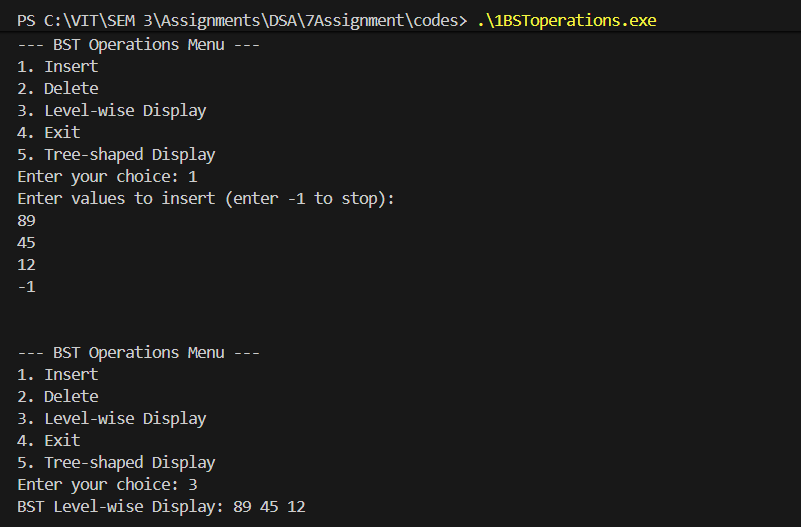

# Assignment No: 7 Problem: 1

## Title: Binary Search Tree (BST) Operations ( Create, Insert, Delete, Level-wise Display)

### Theory
A **Binary Search Tree (BST)** is a special type of binary tree where each node follows the binary search property:  
- The value of the left child is **less than** the value of the parent node.  
- The value of the right child is **greater than** the value of the parent node.

BST operations include:

1. **Creation** – Initializing the root as `NULL`.
2. **Insertion** – Adding nodes to the BST while maintaining the BST property.
3. **Deletion** – Removing a node and reorganizing the tree based on three cases:
   - Node with no children  
   - Node with one child  
   - Node with two children (replace with inorder successor)
4. **Level-wise Display (Level Order Traversal)** – Visiting each level from top to bottom using a queue.


---

### Algorithm

#### **Algorithm for Insertion**
1. If root is `NULL`, create a new node and assign it to root.
2. Otherwise:
   - If value < root → insert into left subtree.
   - If value > root → insert into right subtree.
3. Repeat recursively.

#### **Algorithm for Deletion**
1. Search for the node to delete.
2. Case 1: Node has no children → delete directly.
3. Case 2: Node has one child → replace node with its child.
4. Case 3: Node has two children →  
   - Find inorder successor.  
   - Replace node value.  
   - Delete successor from right subtree.

#### **Algorithm for Level-wise Display**
1. Use a queue.
2. Push root.
3. While queue is not empty:  
   - Pop front element  
   - Print its value  
   - Push left child (if exists)  
   - Push right child (if exists)

---

### C++ Code

```cpp
#include <iostream>
#include <queue>
using namespace std;

struct Nodeasr {
    int data;
    Nodeasr* left;
    Nodeasr* right;
};


Nodeasr* createNodeasr(int valueasr) {
    Nodeasr* newNodeasr = new Nodeasr();
    newNodeasr->data = valueasr;
    newNodeasr->left = newNodeasr->right = NULL;
    return newNodeasr;
}


Nodeasr* insertasr(Nodeasr* rootasr, int valueasr) {
    if (rootasr == NULL) {
        rootasr = createNodeasr(valueasr);
    } 
    else if (valueasr < rootasr->data) {
        rootasr->left = insertasr(rootasr->left, valueasr);
    } 
    else {
        rootasr->right = insertasr(rootasr->right, valueasr);
    }
    return rootasr;
}


Nodeasr* minValueNodeasr(Nodeasr* nodeasr) {
    Nodeasr* currentasr = nodeasr;
    while (currentasr && currentasr->left != NULL)
        currentasr = currentasr->left;
    return currentasr;
}


Nodeasr* deleteNodeasr(Nodeasr* rootasr, int keyasr) {
    if (rootasr == NULL)
        return rootasr;

    if (keyasr < rootasr->data)
        rootasr->left = deleteNodeasr(rootasr->left, keyasr);

    else if (keyasr > rootasr->data)
        rootasr->right = deleteNodeasr(rootasr->right, keyasr);

    else {
        // Case 1: No child
        if (rootasr->left == NULL && rootasr->right == NULL) {
            delete rootasr;
            return NULL;
        }
        // Case 2: One child
        else if (rootasr->left == NULL) {
            Nodeasr* tempasr = rootasr->right;
            delete rootasr;
            return tempasr;
        } 
        else if (rootasr->right == NULL) {
            Nodeasr* tempasr = rootasr->left;
            delete rootasr;
            return tempasr;
        }
        // Case 3: Two children
        Nodeasr* tempasr = minValueNodeasr(rootasr->right);
        rootasr->data = tempasr->data;
        rootasr->right = deleteNodeasr(rootasr->right, tempasr->data);
    }
    return rootasr;
}

// Level-wise display
void levelOrderasr(Nodeasr* rootasr) {
    if (rootasr == NULL) return;

    queue<Nodeasr*> qasr;
    qasr.push(rootasr);

    while (!qasr.empty()) {
        Nodeasr* tempasr = qasr.front();
        qasr.pop();
        cout << tempasr->data << " ";

        if (tempasr->left != NULL)
            qasr.push(tempasr->left);
        if (tempasr->right != NULL)
            qasr.push(tempasr->right);
    }
}

int main() {
    Nodeasr* rootasr = NULL;
    int choiceasr, valueasr;

    do {
        cout << "\n\n--- BST Operations Menu ---\n";
        cout << "1. Insert\n2. Delete\n3. Level-wise Display\n4. Exit\n";
        cout << "Enter your choice: ";
        cin >> choiceasr;

        switch (choiceasr) {
            case 1:
                cout << "Enter value to insert: ";
                cin >> valueasr;
                rootasr = insertasr(rootasr, valueasr);
                break;

            case 2:
                cout << "Enter value to delete: ";
                cin >> valueasr;
                rootasr = deleteNodeasr(rootasr, valueasr);
                break;

            case 3:
                cout << "BST Level-wise Display: ";
                levelOrderasr(rootasr);
                break;

            case 4:
                cout << "Exiting...\n";
                break;

            default:
                cout << "Invalid choice!\n";
        }

    } while (choiceasr != 4);

    return 0;
}

```

### Output

```
PS C:\VIT\SEM 3\Assignments\DSA\7Assignment\codes> .\1BSToperations.exe


--- BST Operations Menu ---
1. Insert
2. Delete
3. Level-wise Display
4. Exit
5. Tree-shaped Display
Enter your choice: 1
Enter values to insert (enter -1 to stop): 
8
5
9
4
6
7
-1


--- BST Operations Menu ---
1. Insert
2. Delete
3. Level-wise Display
4. Exit
5. Tree-shaped Display
Enter your choice: 2
Enter value to delete: 0


--- BST Operations Menu ---
1. Insert
2. Delete
3. Level-wise Display
4. Exit
5. Tree-shaped Display
Enter your choice: 3
BST Level-wise Display: 8 5 9 4 6 7 

--- BST Operations Menu ---
1. Insert
2. Delete
3. Level-wise Display
4. Exit
5. Tree-shaped Display
Enter your choice: 2
Enter value to delete: 9


--- BST Operations Menu ---
1. Insert
2. Delete
3. Level-wise Display
4. Exit
5. Tree-shaped Display
Enter your choice: 3
BST Level-wise Display: 8 5 4 6 7 

--- BST Operations Menu ---
1. Insert
2. Delete
3. Level-wise Display
4. Exit
5. Tree-shaped Display
Enter your choice: 4
Exiting...
PS C:\VIT\SEM 3\Assignments\DSA\7Assignment\codes> 
```

