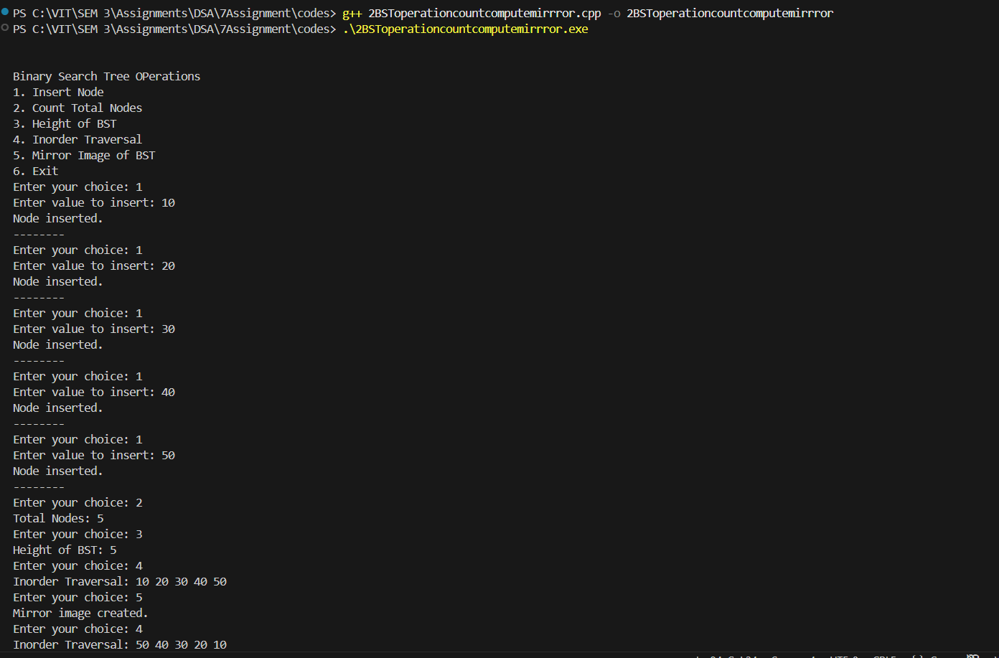

# Assignment No: 7 Problem: 2

## Title:Binary Search Tree (BST) operations (Count the total number of nodes, Compute the height of the BST, Mirror Image ).

---

### Theory

A **Binary Search Tree (BST)** is a hierarchical data structure where each node has at most two children, called the left and right child. The BST property ensures:

- Left child contains a value **less than** its parent.
- Right child contains a value **greater than** its parent.
- No duplicate values are inserted.

**Operations performed in this assignment:**

- **Count Total Nodes:** Count how many nodes exist in the BST through recursion.
- **Compute Height:** Height is the longest path from the root to any leaf node.
- **Mirror Image:** Swap the left and right subtree recursively to form the mirror of the BST.

---

### Algorithm

#### **1. Insert Node**

Step 1: If root is NULL → create a new node and return it.
Step 2: If value < root->data → insert into left subtree.
Step 3: If value > root->data → insert into right subtree.
Step 4: Return updated root.


#### **2. Count Nodes**

Step 1: If root is NULL → return 0.
Step 2: Recursively count left subtree.
Step 3: Recursively count right subtree.
Step 4: Return left + right + 1.


#### **3. Compute Height**

Step 1: If root is NULL → return 0.
Step 2: Compute height of left subtree.
Step 3: Compute height of right subtree.
Step 4: Height = max(left, right) + 1.


#### **4. Mirror Tree**

Step 1: If root is NULL → return.
Step 2: Recursively mirror left subtree.
Step 3: Recursively mirror right subtree.
Step 4: Swap left and right child pointers.


#### **5. Inorder Traversal**

Step 1: If root is NULL → return.
Step 2: Traverse left subtree.
Step 3: Print node value.
Step 4: Traverse right subtree.


---

### C++ Code

```cpp
#include <iostream>
using namespace std;

struct Node_asr {
    int data_asr;
    Node_asr* left_asr;
    Node_asr* right_asr;
};

// Create new node
Node_asr* createNode_asr(int value_asr) {
    Node_asr* temp_asr = new Node_asr();
    temp_asr->data_asr = value_asr;
    temp_asr->left_asr = temp_asr->right_asr = NULL;
    return temp_asr;
}

// Insert into BST
Node_asr* insertNode_asr(Node_asr* root_asr, int value_asr) {
    if (root_asr == NULL)
        return createNode_asr(value_asr);

    if (value_asr < root_asr->data_asr)
        root_asr->left_asr = insertNode_asr(root_asr->left_asr, value_asr);
    else if (value_asr > root_asr->data_asr)
        root_asr->right_asr = insertNode_asr(root_asr->right_asr, value_asr);

    return root_asr;
}

// Count total nodes
int countNodes_asr(Node_asr* root_asr) {
    if (root_asr == NULL)
        return 0;
    return 1 + countNodes_asr(root_asr->left_asr) + countNodes_asr(root_asr->right_asr);
}

// Height of BST
int height_asr(Node_asr* root_asr) {
    if (root_asr == NULL)
        return 0;

    int leftHeight_asr = height_asr(root_asr->left_asr);
    int rightHeight_asr = height_asr(root_asr->right_asr);

    return (leftHeight_asr > rightHeight_asr ? leftHeight_asr : rightHeight_asr) + 1;
}

// Mirror of BST
void mirror_asr(Node_asr* root_asr) {
    if (root_asr == NULL)
        return;

    mirror_asr(root_asr->left_asr);
    mirror_asr(root_asr->right_asr);

    Node_asr* temp_asr = root_asr->left_asr;
    root_asr->left_asr = root_asr->right_asr;
    root_asr->right_asr = temp_asr;
}

// Inorder traversal
void inorder_asr(Node_asr* root_asr) {
    if (root_asr == NULL)
        return;

    inorder_asr(root_asr->left_asr);
    cout << root_asr->data_asr << " ";
    inorder_asr(root_asr->right_asr);
}

int main() {
    Node_asr* root_asr = NULL;
    int choice_asr, value_asr;
    cout << "\n\nBinary Search Tree OPerations\n";
    cout << "1. Insert Node\n";
    cout << "2. Count Total Nodes\n";
    cout << "3. Height of BST\n";
    cout << "4. Inorder Traversal\n";
    cout << "5. Mirror Image of BST\n";
    cout << "6. Exit\n";

    do {
     
        cout << "Enter your choice: ";
        cin >> choice_asr;

        switch (choice_asr) {
            case 1:
                cout << "Enter value to insert: ";
                cin >> value_asr;
                root_asr = insertNode_asr(root_asr, value_asr);
                cout << "Node inserted.\n";
                cout<<"--------\n";
                break;

            case 2:
                cout << "Total Nodes: " << countNodes_asr(root_asr) << endl;
                break;

            case 3:
                cout << "Height of BST: " << height_asr(root_asr) << endl;
                break;

            case 4:
                cout << "Inorder Traversal: ";
                inorder_asr(root_asr);
                cout << endl;
                break;

            case 5:
                mirror_asr(root_asr);
                cout << "Mirror image created.\n";
                break;

            case 6:
                cout << "Exiting...\n";
                break;

            default:
                cout << "Invalid choice! Try again.\n";
        }
    } while (choice_asr != 6);

    return 0;
}

```

### Output

```
Binary Search Tree OPerations
1. Insert Node
2. Count Total Nodes
3. Height of BST
4. Inorder Traversal
5. Mirror Image of BST
6. Exit
Enter your choice: 1
Enter value to insert: 10
Node inserted.
--------
Enter your choice: 1
Enter value to insert: 20
Node inserted.
--------
Enter your choice: 1
Enter value to insert: 30
Node inserted.
--------
Enter your choice: 1
Enter value to insert: 40
Node inserted.
--------
Enter your choice: 1
Enter value to insert: 50
Node inserted.
--------
Enter your choice: 1
Enter value to insert: 60
Node inserted.
--------
Enter your choice: 2
Total Nodes: 6
Enter your choice: 3
Height of BST: 6
Enter your choice: 4
Inorder Traversal: 10 20 30 40 50 60 
Enter your choice: 5
Mirror image created.
Enter your choice: 4
Inorder Traversal: 60 50 40 30 20 10 
Enter your choice: 6
Exiting...

```
