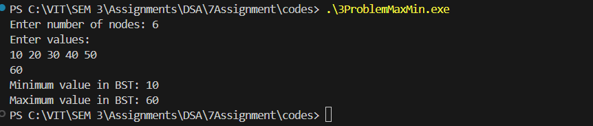

# Assignment No: 7 Problem: 3

## Title: Program to Create a Binary Search Tree and Find Minimum/Maximum in BST

---

### Theory

A **Binary Search Tree (BST)** is a special type of binary tree where:

- Each node contains a key.
- Keys in the **left subtree** are smaller than the node's key.
- Keys in the **right subtree** are greater than the node's key.
- Both left and right subtrees must also be BSTs.

**Finding Minimum** in BST:  
- Move to the **leftmost node** until `left == NULL`.  
- That node holds the smallest value.

**Finding Maximum** in BST:  
- Move to the **rightmost node** until `right == NULL`.  
- That node holds the largest value.

---

### Algorithm

1. **Start**
2. **Create a Node** using a `struct` with data, left, and right pointers.
3. **Insert Elements** into BST:
   - If tree is empty, new node becomes the root.
   - If value < root, insert in left subtree.
   - If value > root, insert in right subtree.
4. **Find Minimum**:
   - Traverse left child until `NULL`.
5. **Find Maximum**:
   - Traverse right child until `NULL`.
6. **Display the Result**
7. **End**

---

### C++ Code

```cpp
#include <iostream>
using namespace std;

struct Node_asr {
    int data_asr;
    Node_asr* left_asr;
    Node_asr* right_asr;
};

// Create new node
Node_asr* createNode_asr(int value_asr) {
    Node_asr* newNode_asr = new Node_asr();
    newNode_asr->data_asr = value_asr;
    newNode_asr->left_asr = newNode_asr->right_asr = nullptr;
    return newNode_asr;
}

// Insert in BST
Node_asr* insertNode_asr(Node_asr* root_asr, int value_asr) {
    if (root_asr == nullptr) {
        root_asr = createNode_asr(value_asr);
    } 
    else if (value_asr < root_asr->data_asr) {
        root_asr->left_asr = insertNode_asr(root_asr->left_asr, value_asr);
    } 
    else {
        root_asr->right_asr = insertNode_asr(root_asr->right_asr, value_asr);
    }
    return root_asr;
}

// Find Minimum
int findMin_asr(Node_asr* root_asr) {
    if (root_asr == nullptr) {
        cout << "Tree is empty!";
        return -1;
    }
    while (root_asr->left_asr != nullptr) {
        root_asr = root_asr->left_asr;
    }
    return root_asr->data_asr;
}

// Find Maximum
int findMax_asr(Node_asr* root_asr) {
    if (root_asr == nullptr) {
        cout << "Tree is empty!";
        return -1;
    }
    while (root_asr->right_asr != nullptr) {
        root_asr = root_asr->right_asr;
    }
    return root_asr->data_asr;
}

int main() {
    Node_asr* root_asr = nullptr;
    int n_asr, value_asr;

    cout << "Enter number of nodes: ";
    cin >> n_asr;

    cout << "Enter values:\n";
    for (int i = 0; i < n_asr; i++) {
        cin >> value_asr;
        root_asr = insertNode_asr(root_asr, value_asr);
    }

    cout << "Minimum value in BST: " << findMin_asr(root_asr) << endl;
    cout << "Maximum value in BST: " << findMax_asr(root_asr) << endl;

    return 0;
}
```

### Output

```
Enter number of nodes: 6
Enter values:
10 20 30 40 50 
60
Minimum value in BST: 10
Maximum value in BST: 60

```

