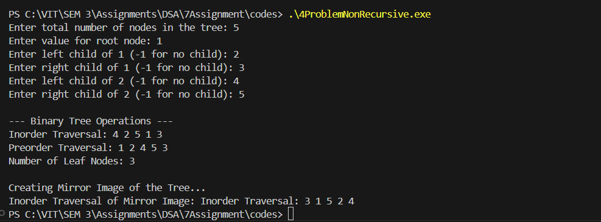

# Assignment No: 7 Problem: 4

## Title:Non-Recursive  Binary Tree Operations


## Theory

A **Binary Tree** is a hierarchical structure in which each node has at most two children named **left child** and **right child**.  
This assignment focuses on building a **Level-Order Binary Tree using user input** and performing the following **non-recursive operations**:

### **Operations Performed**
1. **Non-Recursive Inorder Traversal**  
   Visits nodes in the order: *Left → Root → Right*.  
   Uses a stack to simulate recursion.

2. **Non-Recursive Preorder Traversal**  
   Visits nodes in the order: *Root → Left → Right*.  
   Uses a stack.

3. **Counting Leaf Nodes**  
   Leaf nodes are nodes with no children.  
   Uses a stack-based traversal.

4. **Mirror Image of the Tree (Non-Recursive)**  
   Swaps left and right children of all nodes using stack-based traversal.

Additionally, the tree is constructed **level-wise** using a queue.

---

## Algorithm

### 1. **Create Binary Tree (Level Order)**
1. Input number of nodes.  
2. Read root value and create the root.  
3. Use a queue to insert children level-wise.  
4. For each node:  
   - Read left child (use `-1` for no child).  
   - Read right child.  
5. Repeat until required nodes are inserted.

### 2. **Non-Recursive Inorder Traversal**
1. Start from the root.  
2. Push left nodes onto stack.  
3. Pop from stack, visit node.  
4. Move to right node.  
5. Continue until stack is empty.

### 3. **Non-Recursive Preorder Traversal**
1. Push root onto stack.  
2. Pop top → visit node.  
3. Push right child, then left child.  
4. Continue until stack is empty.

### 4. **Count Leaf Nodes**
1. Push root onto stack.  
2. Pop each node:  
   - If node has no children → increment counter.  
3. Push its children if they exist.

### 5. **Mirror Image of Tree (Non-Recursive)**
1. Use a stack.  
2. For each popped node:  
   - Swap `left_asr` and `right_asr`.  
3. Push children for further processing.

---

## C++ Code

```cpp
#include <iostream>
#include <queue>
#include <stack>
using namespace std;

struct Node_asr {
    int data_asr;
    Node_asr *left_asr, *right_asr;

    Node_asr(int val_asr) {
        data_asr = val_asr;
        left_asr = right_asr = nullptr;
    }
};

// Create Binary Tree (Level Order)
Node_asr* createTree_asr(int n_asr) {
    if (n_asr <= 0) return nullptr;

    int val_asr;
    cout << "Enter value for root node: ";
    cin >> val_asr;

    Node_asr* root_asr = new Node_asr(val_asr);
    queue<Node_asr*> q_asr;
    q_asr.push(root_asr);

    int count_asr = 1;

    while (count_asr < n_asr) {
        Node_asr* curr_asr = q_asr.front();
        q_asr.pop();

        int leftVal_asr, rightVal_asr;

        cout << "Enter left child of " << curr_asr->data_asr 
             << " (-1 for no child): ";
        cin >> leftVal_asr;

        if (leftVal_asr != -1) {
            curr_asr->left_asr = new Node_asr(leftVal_asr);
            q_asr.push(curr_asr->left_asr);
            count_asr++;
            if (count_asr == n_asr) break;
        }

        cout << "Enter right child of " << curr_asr->data_asr 
             << " (-1 for no child): ";
        cin >> rightVal_asr;

        if (rightVal_asr != -1) {
            curr_asr->right_asr = new Node_asr(rightVal_asr);
            q_asr.push(curr_asr->right_asr);
            count_asr++;
        }
    }

    return root_asr;
}

// Nonrecursive Inorder Traversal
void inorderTraversal_asr(Node_asr* root_asr) {
    stack<Node_asr*> s_asr;
    Node_asr* curr_asr = root_asr;

    cout << "Inorder Traversal: ";
    while (curr_asr != nullptr || !s_asr.empty()) {
        while (curr_asr != nullptr) {
            s_asr.push(curr_asr);
            curr_asr = curr_asr->left_asr;
        }
        curr_asr = s_asr.top();
        s_asr.pop();
        cout << curr_asr->data_asr << " ";
        curr_asr = curr_asr->right_asr;
    }
    cout << endl;
}

// Nonrecursive Preorder Traversal
void preorderTraversal_asr(Node_asr* root_asr) {
    if (!root_asr) return;

    stack<Node_asr*> s_asr;
    s_asr.push(root_asr);

    cout << "Preorder Traversal: ";
    while (!s_asr.empty()) {
        Node_asr* curr_asr = s_asr.top();
        s_asr.pop();

        cout << curr_asr->data_asr << " ";

        if (curr_asr->right_asr)
            s_asr.push(curr_asr->right_asr);
        if (curr_asr->left_asr)
            s_asr.push(curr_asr->left_asr);
    }
    cout << endl;
}

// Count Leaf Nodes
int countLeafNodes_asr(Node_asr* root_asr) {
    if (!root_asr) return 0;

    stack<Node_asr*> s_asr;
    s_asr.push(root_asr);

    int count_asr = 0;

    while (!s_asr.empty()) {
        Node_asr* curr_asr = s_asr.top();
        s_asr.pop();

        if (!curr_asr->left_asr && !curr_asr->right_asr)
            count_asr++;

        if (curr_asr->right_asr)
            s_asr.push(curr_asr->right_asr);
        if (curr_asr->left_asr)
            s_asr.push(curr_asr->left_asr);
    }

    return count_asr;
}

// Nonrecursive Mirror Image
void mirrorTree_asr(Node_asr* root_asr) {
    if (!root_asr) return;

    stack<Node_asr*> s_asr;
    s_asr.push(root_asr);

    while (!s_asr.empty()) {
        Node_asr* curr_asr = s_asr.top();
        s_asr.pop();

        // Swap left and right children
        swap(curr_asr->left_asr, curr_asr->right_asr);

        if (curr_asr->left_asr)
            s_asr.push(curr_asr->left_asr);
        if (curr_asr->right_asr)
            s_asr.push(curr_asr->right_asr);
    }
}

int main() {
    int n_asr;
    cout << "Enter total number of nodes in the tree: ";
    cin >> n_asr;

    Node_asr* root_asr = createTree_asr(n_asr);

    cout << "\n--- Binary Tree Operations ---\n";
    inorderTraversal_asr(root_asr);
    preorderTraversal_asr(root_asr);

    cout << "Number of Leaf Nodes: " 
         << countLeafNodes_asr(root_asr) << endl;

    cout << "\nCreating Mirror Image of the Tree...\n";
    mirrorTree_asr(root_asr);

    cout << "Inorder Traversal of Mirror Image: ";
    inorderTraversal_asr(root_asr);

    return 0;
}

```

### Output

```
Enter total number of nodes: 5
Enter value for root node: 1
Enter left child of 1: 2
Enter right child of 1: 3
Enter left child of 2: 4
Enter right child of 2: 5

--- Binary Tree Operations ---
Inorder Traversal: 4 2 5 1 3
Preorder Traversal: 1 2 4 5 3
Number of Leaf Nodes: 3

Creating Mirror Image of the Tree...
Inorder Traversal of Mirror Image: 3 1 5 2 4
```
