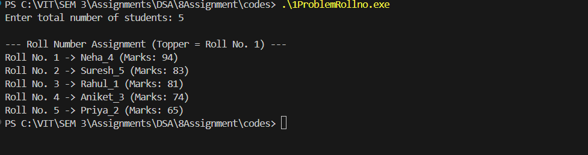

# Assignment No: 8 Problem: 1

## Title: Write a program, using trees, to assign roll numbers to students based on their previous year’s result (Topper = Roll No. 1)
### Theory

In academic systems, students are often assigned roll numbers on the basis of their previous year’s performance, with the topper receiving Roll No. 1.
To automate this process, we can use a Binary Search Tree (BST) where:

-   Each node represents a student
-   The key is the student’s marks
-   Students with lower marks go to the left subtree
-   Students with higher marks go to the right subtree

After constructing the BST, we perform a reverse inorder traversal (Right → Root → Left) because this gives the students in descending order of marks.
Thus, the topper is visited first and assigned Roll No. 1.

---

### Algorithm

1. Initialize an empty BST.  
2. For each student:  
   - Create a new node containing name and marks.  
   - Insert the node into the BST based on marks.  
3. Set roll number = 1.  
4. Perform a *reverse inorder traversal*:  
   - Visit the right subtree  
   - Assign roll number to the current student  
   - Visit the left subtree  
5. Display roll number, name, and marks.  
6. End.

---

### C++ Code

```cpp
#include <iostream>
#include <string>
#include <cstdlib>
#include <ctime>
using namespace std;

// Structure for student node
struct Student_asr {
    string name_asr;
    int marks_asr;
    Student_asr *left_asr, *right_asr;
};

// Create a new student node
Student_asr* createStudent_asr(string name_asr, int marks_asr) {
    Student_asr* node_asr = new Student_asr();
    node_asr->name_asr = name_asr;
    node_asr->marks_asr = marks_asr;
    node_asr->left_asr = node_asr->right_asr = nullptr;
    return node_asr;
}

// Insert student into BST based on marks
Student_asr* insertStudent_asr(Student_asr* root_asr, string name_asr, int marks_asr) {
    if (root_asr == nullptr)
        return createStudent_asr(name_asr, marks_asr);

    if (marks_asr < root_asr->marks_asr)
        root_asr->left_asr = insertStudent_asr(root_asr->left_asr, name_asr, marks_asr);
    else
        root_asr->right_asr = insertStudent_asr(root_asr->right_asr, name_asr, marks_asr);

    return root_asr;
}

// Assign roll numbers using reverse inorder traversal
void assignRollNumbers_asr(Student_asr* root_asr, int &roll_asr) {
    if (root_asr == nullptr)
        return;

    assignRollNumbers_asr(root_asr->right_asr, roll_asr);

    cout << "Roll No. " << roll_asr << " -> "
         << root_asr->name_asr << " (Marks: "
         << root_asr->marks_asr << ")\n";
    roll_asr++;

    assignRollNumbers_asr(root_asr->left_asr, roll_asr);
}

int main() {
    srand(time(0));
    int n_asr;

    cout << "Enter total number of students: ";
    cin >> n_asr;

    string sampleNames_asr[] = {
        "Rahul", "Priya", "Aniket", "Neha", "Suresh", "Aarav", "Riya", 
        "Tanish", "Sneha", "Aditya", "Kiran", "Manoj", "Pooja", "Vikas",
        "Shreya", "Omkar", "Nisha", "Akash", "Meena", "Rohan"
    };

    int totalNames_asr = 20;
    Student_asr* root_asr = nullptr;

    // Generate random students and marks
    for (int i = 0; i < n_asr; i++) {
        string name_asr = sampleNames_asr[i % totalNames_asr] + "_" + to_string(i + 1);
        int marks_asr = rand() % 51 + 50; // Marks between 50–100
        root_asr = insertStudent_asr(root_asr, name_asr, marks_asr);
    }

    cout << "\n--- Roll Number Assignment (Topper = Roll No. 1) ---\n";
    int roll_asr = 1;
    assignRollNumbers_asr(root_asr, roll_asr);

    return 0;
}
```

### Output

```
Enter total number of students: 5

--- Roll Number Assignment (Topper = Roll No. 1) ---
Roll No. 1 -> Neha_4 (Marks: 94)
Roll No. 2 -> Suresh_5 (Marks: 83)
Roll No. 3 -> Rahul_1 (Marks: 81)
Roll No. 4 -> Aniket_3 (Marks: 74)
Roll No. 5 -> Priya_2 (Marks: 65)

```
