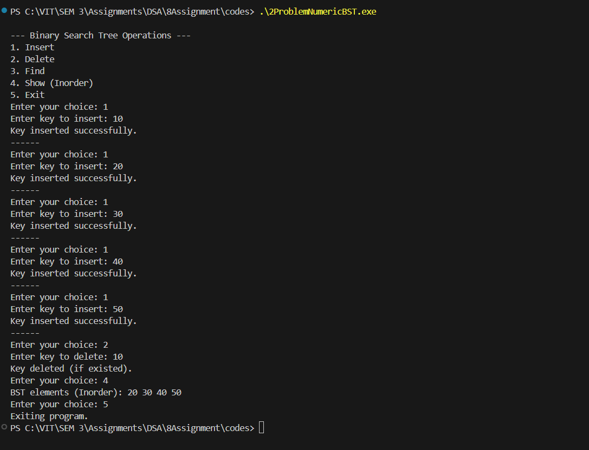

# Assignment No: 8 Problem: 2

## Title: Operations on a Binary Search Tree (BST)

### Theory
A **Binary Search Tree (BST)** is a non-linear data structure in which every node contains a key, and it follows specific ordering rules:
- The left child of a node contains keys **less than** the node’s key.
- The right child contains keys **greater than** the node’s key.
- No duplicate keys are allowed.

BST supports efficient operations such as insertion, deletion, searching, and traversal, making it useful for applications like databases, indexing, and symbol tables.

The main operations performed in this assignment are:
- **Insert**: Add a new key while maintaining BST properties.
- **Delete**: Remove a key from the tree and adjust links accordingly.
- **Find/Search**: Check whether a key exists in the BST.
- **Show (Inorder Traversal)**: Displays keys in ascending order.

---

### Algorithm

#### **1. Insertion Algorithm**
1. If the tree is empty, create a new node.
2. If the key is less than the root key, recursively insert into the left subtree.
3. If the key is greater, insert into the right subtree.
4. Return the updated root.

#### **2. Search Algorithm**
1. If the node is `NULL`, return false.
2. If key matches the node’s key, return true.
3. If key is smaller, search in left subtree.
4. Otherwise, search in right subtree.

#### **3. Find Minimum (for deletion)**
1. Traverse left pointers until `NULL` is reached.
2. Return the left-most node.

#### **4. Deletion Algorithm**
1. Recursively traverse to the key.
2. If node has:
   - **No child** → delete node.
   - **One child** → replace node with its child.
   - **Two children** → find inorder successor, replace key, and delete successor.
3. Return updated root.

#### **5. Inorder Traversal**
1. Recursively traverse left subtree.
2. Visit (print) the node.
3. Recursively traverse right subtree.

---

### C++ Code
```cpp
#include <iostream>
using namespace std;

// Structure for a BST node
struct Node_asr {
    int key_asr;
    Node_asr *left_asr, *right_asr;
    Node_asr(int val_asr) {
        key_asr = val_asr;
        left_asr = right_asr = nullptr;
    }
};

// Insert a new key into BST
Node_asr* insertNode_asr(Node_asr* root_asr, int key_asr) {
    if (root_asr == nullptr)
        return new Node_asr(key_asr);
    if (key_asr < root_asr->key_asr)
        root_asr->left_asr = insertNode_asr(root_asr->left_asr, key_asr);
    else if (key_asr > root_asr->key_asr)
        root_asr->right_asr = insertNode_asr(root_asr->right_asr, key_asr);
    return root_asr;
}

// Find minimum value node (used in deletion)
Node_asr* findMin_asr(Node_asr* node_asr) {
    Node_asr* current_asr = node_asr;
    while (current_asr && current_asr->left_asr != nullptr)
        current_asr = current_asr->left_asr;
    return current_asr;
}

// Delete a key from BST
Node_asr* deleteNode_asr(Node_asr* root_asr, int key_asr) {
    if (root_asr == nullptr)
        return root_asr;

    if (key_asr < root_asr->key_asr)
        root_asr->left_asr = deleteNode_asr(root_asr->left_asr, key_asr);
    else if (key_asr > root_asr->key_asr)
        root_asr->right_asr = deleteNode_asr(root_asr->right_asr, key_asr);
    else {
        // Node with one or no child
        if (root_asr->left_asr == nullptr) {
            Node_asr* temp_asr = root_asr->right_asr;
            delete root_asr;
            return temp_asr;
        } else if (root_asr->right_asr == nullptr) {
            Node_asr* temp_asr = root_asr->left_asr;
            delete root_asr;
            return temp_asr;
        }
        // Node with two children
        Node_asr* temp_asr = findMin_asr(root_asr->right_asr);
        root_asr->key_asr = temp_asr->key_asr;
        root_asr->right_asr = deleteNode_asr(root_asr->right_asr, temp_asr->key_asr);
    }
    return root_asr;
}

// Search a key in BST
bool searchNode_asr(Node_asr* root_asr, int key_asr) {
    if (root_asr == nullptr)
        return false;
    if (root_asr->key_asr == key_asr)
        return true;
    if (key_asr < root_asr->key_asr)
        return searchNode_asr(root_asr->left_asr, key_asr);
    else
        return searchNode_asr(root_asr->right_asr, key_asr);
}

// Inorder traversal (sorted order)
void inorder_asr(Node_asr* root_asr) {
    if (root_asr == nullptr)
        return;
    inorder_asr(root_asr->left_asr);
    cout << root_asr->key_asr << " ";
    inorder_asr(root_asr->right_asr);
}

int main() {
    Node_asr* root_asr = nullptr;
    int choice_asr, key_asr;
    cout << "\n--- Binary Search Tree Operations ---\n";
    cout << "1. Insert\n2. Delete\n3. Find\n4. Show (Inorder)\n5. Exit\n";
    while (true) {
   
        cout << "Enter your choice: ";
        cin >> choice_asr;

        switch (choice_asr) {
            case 1:
                cout << "Enter key to insert: ";
                cin >> key_asr;
                root_asr = insertNode_asr(root_asr, key_asr);
                cout << "Key inserted successfully.\n";
                break;

            case 2:
                cout << "Enter key to delete: ";
                cin >> key_asr;
                root_asr = deleteNode_asr(root_asr, key_asr);
                cout << "Key deleted (if existed).\n";
                break;

            case 3:
                cout << "Enter key to find: ";
                cin >> key_asr;
                if (searchNode_asr(root_asr, key_asr))
                    cout << "Key found in BST.\n";
                else
                    cout << "Key not found.\n";
                break;

            case 4:
                cout << "BST elements (Inorder): ";
                inorder_asr(root_asr);
                cout << endl;
                break;

            case 5:
                cout << "Exiting program.\n";
                return 0;

            default:
                cout << "Invalid choice. Please try again.\n";
        }
    }
}
```

### Output

```
--- Binary Search Tree Operations ---
1. Insert
2. Delete
3. Find
4. Show (Inorder)
5. Exit
Enter your choice: 1
Enter key to insert: 10
Key inserted successfully.
------
Enter your choice: 1
Enter key to insert: 20
Key inserted successfully.
------
Enter your choice: 1
Enter key to insert: 30
Key inserted successfully.
------
Enter your choice: 1
Enter key to insert: 40
Key inserted successfully.
------
Enter your choice: 1
Enter key to insert: 50
Key inserted successfully.
------
Enter your choice: 2
Enter key to delete: 10
Key deleted (if existed).
Enter your choice: 4
BST elements (Inorder): 20 30 40 50
Enter your choice: 5
Exiting program.
PS C:\VIT\SEM 3\Assignments\DSA\8Assignment\codes>


Enter your choice: 1
Enter key to insert: 40
Key inserted successfully.
------
Enter your choice: 1
Enter key to insert: 50
Key inserted successfully.
------
Enter your choice: 2
Enter key to delete: 10
Key deleted (if existed).
Enter your choice: 4
BST elements (Inorder): 20 30 40 50
Enter your choice: 5
Exiting program.
PS C:\VIT\SEM 3\Assignments\DSA\8Assignment\codes>


Enter your choice: 1
Enter key to insert: 40
Key inserted successfully.
------
Enter your choice: 1
Enter key to insert: 50
Key inserted successfully.
------
Enter your choice: 2
Enter key to delete: 10
Key deleted (if existed).
Enter your choice: 4
BST elements (Inorder): 20 30 40 50
Enter your choice: 5
Enter your choice: 1
Enter key to insert: 40
Key inserted successfully.
------
Enter your choice: 1
Enter key to insert: 50
Key inserted successfully.
------
Enter your choice: 2
Enter key to delete: 10
Key deleted (if existed).
Enter your choice: 1
Enter key to insert: 40
Key inserted successfully.
------
Enter your choice: 1
Enter key to insert: 50
Key inserted successfully.
------
Enter your choice: 2
Enter your choice: 1
Enter key to insert: 40
Key inserted successfully.
------
Enter your choice: 1
Enter key to insert: 50
Key inserted successfully.
------
Enter your choice: 1
Enter key to insert: 40
Key inserted successfully.
------
Enter your choice: 1
Enter key to insert: 50
Key inserted successfully.
Enter your choice: 1
Enter key to insert: 40
Key inserted successfully.
------
Enter your choice: 1
Enter key to insert: 50
Key inserted successfully.
Enter your choice: 1
Enter key to insert: 40
Key inserted successfully.
------
Enter your choice: 1
Enter your choice: 1
Enter key to insert: 40
Enter your choice: 1
Enter key to insert: 40
Key inserted successfully.
------
Enter your choice: 1
Enter key to insert: 50
Key inserted successfully.
------
Enter your choice: 2
Enter key to delete: 10
Key deleted (if existed).
Enter your choice: 4
BST elements (Inorder): 20 30 40 50
Enter your choice: 5
Exiting program.

```
