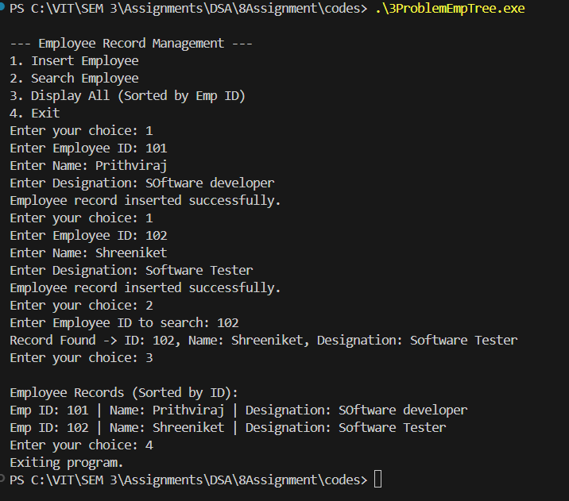

# Assignment No: 8 Problem: 3

## Title: Write a program to efficiently search a particular employee record using Tree Data Structure and display data sorted by Employee ID.


### Theory

A Binary Search Tree (BST) is a hierarchical data structure used to store data in sorted order.  
Each node contains a key, and every node to the left subtree has a smaller key, while every node to the right subtree has a larger key.  

**Why BST for Employee Search?**
- Efficient search operation: O(log n) on average  
- Supports dynamic insertion  
- Automatic sorted ordering using inorder traversal  
- Suitable for storing employee records where quick lookup by ID is required  

In this assignment, the employee data (ID, name, designation) is stored in a BST.  
Insertion maintains BST rules, search follows key comparison, and inorder traversal prints sorted records.

---

### Algorithm

#### Algorithm: Insert Employee into BST
1. If the root is NULL, create a new node and return it.  
2. If `emp_id` is less than root’s ID → recursively insert into left subtree.  
3. If `emp_id` is greater → recursively insert into right subtree.  
4. Return the updated root.

#### Algorithm: Search Employee
1. If root is NULL → employee not found.  
2. If `emp_id == root->emp_id` → return root.  
3. If `emp_id < root->emp_id` → search left subtree.  
4. Else → search right subtree.

#### Algorithm: Display Employees in Ascending Order
1. Perform inorder traversal:  
   - Visit left subtree  
   - Print current node  
   - Visit right subtree  

---

### C++ Code

```cpp
#include <iostream>
#include <string>
using namespace std;

// Structure for Employee node
struct Employee_asr {
    int emp_id_asr;
    string name_asr;
    string designation_asr;
    Employee_asr *left_asr, *right_asr;

    Employee_asr(int id_asr, string name_asr, string desg_asr) {
        emp_id_asr = id_asr;
        this->name_asr = name_asr;
        this->designation_asr = desg_asr;
        left_asr = right_asr = nullptr;
    }
};

// Insert employee into BST
Employee_asr* insertEmployee_asr(Employee_asr* root_asr, int id_asr, string name_asr, string desg_asr) {
    if (root_asr == nullptr)
        return new Employee_asr(id_asr, name_asr, desg_asr);

    if (id_asr < root_asr->emp_id_asr)
        root_asr->left_asr = insertEmployee_asr(root_asr->left_asr, id_asr, name_asr, desg_asr);
    else if (id_asr > root_asr->emp_id_asr)
        root_asr->right_asr = insertEmployee_asr(root_asr->right_asr, id_asr, name_asr, desg_asr);

    return root_asr;
}

// Search employee by ID
Employee_asr* searchEmployee_asr(Employee_asr* root_asr, int id_asr) {
    if (root_asr == nullptr || root_asr->emp_id_asr == id_asr)
        return root_asr;

    if (id_asr < root_asr->emp_id_asr)
        return searchEmployee_asr(root_asr->left_asr, id_asr);
    else
        return searchEmployee_asr(root_asr->right_asr, id_asr);
}

// Display employee records in ascending order
void inorderDisplay_asr(Employee_asr* root_asr) {
    if (root_asr == nullptr)
        return;

    inorderDisplay_asr(root_asr->left_asr);
    cout << "Emp ID: " << root_asr->emp_id_asr
         << " | Name: " << root_asr->name_asr
         << " | Designation: " << root_asr->designation_asr << endl;
    inorderDisplay_asr(root_asr->right_asr);
}

int main() {
    Employee_asr* root_asr = nullptr;
    int choice_asr, id_asr;
    string name_asr, desg_asr;

    while (true) {
        cout << "\n--- Employee Record Management ---\n";
        cout << "1. Insert Employee\n2. Search Employee\n3. Display All (Sorted by Emp ID)\n4. Exit\n";
        cout << "Enter your choice: ";
        cin >> choice_asr;

        switch (choice_asr) {
            case 1:
                cout << "Enter Employee ID: ";
                cin >> id_asr;
                cout << "Enter Name: ";
                cin.ignore();
                getline(cin, name_asr);
                cout << "Enter Designation: ";
                getline(cin, desg_asr);
                root_asr = insertEmployee_asr(root_asr, id_asr, name_asr, desg_asr);
                cout << "Employee record inserted successfully.\n";
                break;

            case 2:
                cout << "Enter Employee ID to search: ";
                cin >> id_asr;
                {
                    Employee_asr* result_asr = searchEmployee_asr(root_asr, id_asr);
                    if (result_asr)
                        cout << "Record Found -> ID: " << result_asr->emp_id_asr
                             << ", Name: " << result_asr->name_asr
                             << ", Designation: " << result_asr->designation_asr << endl;
                    else
                        cout << "Employee not found.\n";
                }
                break;

            case 3:
                cout << "\nEmployee Records (Sorted by ID):\n";
                inorderDisplay_asr(root_asr);
                break;

            case 4:
                cout << "Exiting program.\n";
                return 0;

            default:
                cout << "Invalid choice. Try again.\n";
        }
    }
}
```

### Output

```
--- Employee Record Management ---
1. Insert Employee
2. Search Employee
3. Display All (Sorted by Emp ID)
4. Exit
Enter your choice: 1
Enter Employee ID: 101 
Enter Name: Prithviraj
Enter Designation: Software Developer
Employee record inserted successfully.
Enter your choice: 1
Enter Employee ID: 102
Enter Name: Shreeniket
Enter Designation: Software Tester
Employee record inserted successfully.
Enter your choice: 2
Enter Employee ID to search: 102
Record Found -> ID: 102, Name: Shreeniket, Designation: Software Tester
Enter your choice: 3

Employee Records (Sorted by ID):
Emp ID: 101 | Name: Prithviraj | Designation: Software Developer
Emp ID: 102 | Name: Shreeniket | Designation: Software Tester
Enter your choice: 4
Exiting program.

```
