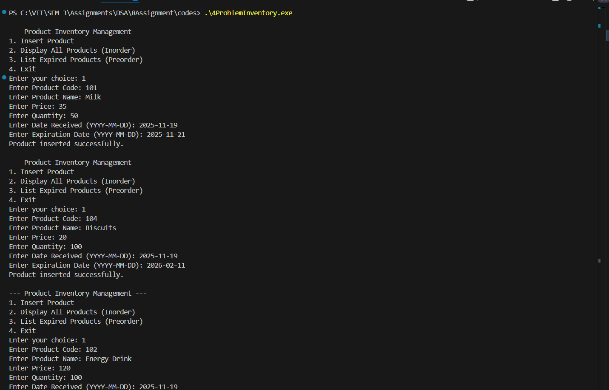

# Assignment No: 8 Problem: 4

## Title: Product Inventory Management System Using Search Tree

## Theory

A **search tree (Binary Search Tree)** is a hierarchical data structure used to store data in a sorted manner, allowing efficient insertion, deletion, and searching operations.  
In this assignment, a search tree is used to manage a product inventory system for a shop. Each product stores details such as product code, name, price, quantity, date received, and expiration date.

The tree is organized **based on product names**, enabling alphabetical ordering.  
Three major operations are implemented:

1. **Insert Product** – Adds a new product node into the tree based on alphabetical order of product names.  
2. **Display All Products (Inorder Traversal)** – Traverses the tree in sorted order (Left → Root → Right) and displays all product details.  
3. **List Expired Items (Preorder Traversal)** – Checks expiration dates and lists expired items using preorder (Root → Left → Right) traversal.

This ensures efficient organization, retrieval, and management of inventory data.

---

## Algorithm

### **1. Insert Product into Tree**
1. If the tree is empty, create a new node and set it as root.  
2. Compare the new product’s name with the root’s name.  
3. If name is smaller, go to the left subtree and repeat insertion.  
4. If name is larger, go to the right subtree and repeat insertion.  
5. Return the updated root each time.

---

### **2. Inorder Display (Sorted Listing)**
1. If tree is empty, return.  
2. Traverse left subtree.  
3. Display current node details.  
4. Traverse right subtree.  

---

### **3. List Expired Products (Preorder)**
1. If tree is empty, return.  
2. Convert product expiry date to time format.  
3. Compare with current system time.  
4. If expired, print product details.  
5. Traverse left subtree.  
6. Traverse right subtree.

---

## C++ Code

```cpp
#include <iostream>
#include <string>
#include <ctime>
using namespace std;

// Structure for Product node
struct Product_asr {
    string code_asr, name_asr, date_received_asr, expiry_date_asr;
    float price_asr;
    int quantity_asr;
    Product_asr *left_asr, *right_asr;

    Product_asr(string c_asr, string n_asr, float p_asr, int q_asr, string dr_asr, string ed_asr) {
        code_asr = c_asr;
        name_asr = n_asr;
        price_asr = p_asr;
        quantity_asr = q_asr;
        date_received_asr = dr_asr;
        expiry_date_asr = ed_asr;
        left_asr = right_asr = nullptr;
    }
};

// Convert "YYYY-MM-DD" to time_t
time_t convertToTime_asr(string date_asr) {
    tm t = {};
    sscanf(date_asr.c_str(), "%d-%d-%d", &t.tm_year, &t.tm_mon, &t.tm_mday);
    t.tm_year -= 1900;
    t.tm_mon -= 1;
    return mktime(&t);
}

// Insert product based on name
Product_asr* insertProduct_asr(Product_asr* root_asr, string code_asr, string name_asr, float price_asr, int qty_asr, string dr_asr, string ed_asr) {
    if (root_asr == nullptr)
        return new Product_asr(code_asr, name_asr, price_asr, qty_asr, dr_asr, ed_asr);

    if (name_asr < root_asr->name_asr)
        root_asr->left_asr = insertProduct_asr(root_asr->left_asr, code_asr, name_asr, price_asr, qty_asr, dr_asr, ed_asr);
    else if (name_asr > root_asr->name_asr)
        root_asr->right_asr = insertProduct_asr(root_asr->right_asr, code_asr, name_asr, price_asr, qty_asr, dr_asr, ed_asr);

    return root_asr;
}

// Inorder display (sorted)
void inorderDisplay_asr(Product_asr* root_asr) {
    if (root_asr == nullptr)
        return;

    inorderDisplay_asr(root_asr->left_asr);
    cout << "Code: " << root_asr->code_asr
         << " | Name: " << root_asr->name_asr
         << " | Price: " << root_asr->price_asr
         << " | Quantity: " << root_asr->quantity_asr
         << " | Received: " << root_asr->date_received_asr
         << " | Expiry: " << root_asr->expiry_date_asr << endl;
    inorderDisplay_asr(root_asr->right_asr);
}

// List expired products in preorder
void listExpiredItems_asr(Product_asr* root_asr) {
    if (root_asr == nullptr)
        return;

    time_t now = time(0);
    time_t expDate = convertToTime_asr(root_asr->expiry_date_asr);

    if (difftime(expDate, now) < 0) {
        cout << "Expired -> " << root_asr->name_asr
             << " | Code: " << root_asr->code_asr
             << " | Expired on: " << root_asr->expiry_date_asr << endl;
    }

    listExpiredItems_asr(root_asr->left_asr);
    listExpiredItems_asr(root_asr->right_asr);
}

int main() {
    Product_asr* root_asr = nullptr;
    int choice_asr;
    string code_asr, name_asr, dr_asr, ed_asr;
    float price_asr;
    int qty_asr;

    while (true) {
        cout << "\n--- Product Inventory Management ---\n";
        cout << "1. Insert Product\n2. Display All Products (Inorder)\n3. List Expired Products (Preorder)\n4. Exit\n";
        cout << "Enter your choice: ";
        cin >> choice_asr;

        switch (choice_asr) {
            case 1:
                cout << "Enter Product Code: ";
                cin >> code_asr;
                cout << "Enter Product Name: ";
                cin.ignore();
                getline(cin, name_asr);
                cout << "Enter Price: ";
                cin >> price_asr;
                cout << "Enter Quantity: ";
                cin >> qty_asr;
                cout << "Enter Date Received (YYYY-MM-DD): ";
                cin >> dr_asr;
                cout << "Enter Expiration Date (YYYY-MM-DD): ";
                cin >> ed_asr;
                root_asr = insertProduct_asr(root_asr, code_asr, name_asr, price_asr, qty_asr, dr_asr, ed_asr);
                cout << "Product inserted successfully.\n";
                break;

            case 2:
                cout << "\n--- Product Inventory (Sorted by Name) ---\n";
                inorderDisplay_asr(root_asr);
                break;

            case 3:
                cout << "\n--- Expired Products ---\n";
                listExpiredItems_asr(root_asr);
                break;

            case 4:
                cout << "Exiting program.\n";
                return 0;

            default:
                cout << "Invalid choice. Try again.\n";
        }
    }
}
```

### Output

```
PS C:\VIT\SEM 3\Assignments\DSA\8Assignment\codes> .\4ProblemInventory.exe

--- Product Inventory Management ---
1. Insert Product
2. Display All Products (Inorder)
3. List Expired Products (Preorder)
4. Exit
Enter your choice: 1
Enter Product Code: 101
Enter Product Name: Milk
Enter Price: 35
Enter Quantity: 50
Enter Date Received (YYYY-MM-DD): 2025-11-19
Enter Expiration Date (YYYY-MM-DD): 2025-11-21
Product inserted successfully.

--- Product Inventory Management ---
1. Insert Product
2. Display All Products (Inorder)
3. List Expired Products (Preorder)
4. Exit
Enter your choice: 1
Enter Product Code: 104
Enter Product Name: Biscuits
Enter Price: 20
Enter Quantity: 100
Enter Date Received (YYYY-MM-DD): 2025-11-19
Enter Expiration Date (YYYY-MM-DD): 2026-02-11
Product inserted successfully.

--- Product Inventory Management ---
1. Insert Product
2. Display All Products (Inorder)
3. List Expired Products (Preorder)
4. Exit
Enter your choice: 1
Enter Product Code: 102
Enter Product Name: Energy Drink
Enter Price: 120
Enter Quantity: 100
Enter Date Received (YYYY-MM-DD): 2025-11-19
Enter Expiration Date (YYYY-MM-DD): 2026-09-01
Product inserted successfully.

--- Product Inventory Management ---
1. Insert Product
2. Display All Products (Inorder)
3. List Expired Products (Preorder)
4. Exit
Enter your choice: 2

--- Product Inventory (Sorted by Name) ---
Code: 104 | Name: Biscuits | Price: 20 | Quantity: 100 | Received: 2025-11-19 | Expiry: 2026-02-11
Code: 102 | Name: Energy Drink | Price: 120 | Quantity: 100 | Received: 2025-11-19 | Expiry: 2026-09-01
Code: 101 | Name: Milk | Price: 35 | Quantity: 50 | Received: 2025-11-19 | Expiry: 2025-11-21

--- Product Inventory Management ---
1. Insert Product
2. Display All Products (Inorder)
3. List Expired Products (Preorder)
4. Exit
Enter your choice: 3

--- Expired Products ---

--- Product Inventory Management ---
1. Insert Product
2. Display All Products (Inorder)
3. List Expired Products (Preorder)
4. Exit
Enter your choice: 1
Enter Product Code: 103
Enter Product Name: Toast
Enter Price: 40
Enter Quantity: 30
Enter Date Received (YYYY-MM-DD): 2025-11-10
Enter Expiration Date (YYYY-MM-DD): 2025-11-18
Product inserted successfully.

--- Product Inventory Management ---
1. Insert Product
2. Display All Products (Inorder)
3. List Expired Products (Preorder)
4. Exit
Enter your choice: 3

--- Expired Products ---
Expired -> Toast | Code: 103 | Expired on: 2025-11-18

--- Product Inventory Management ---
1. Insert Product
2. Display All Products (Inorder)
3. List Expired Products (Preorder)
4. Exit
Enter your choice: 4
Exiting program.

```
