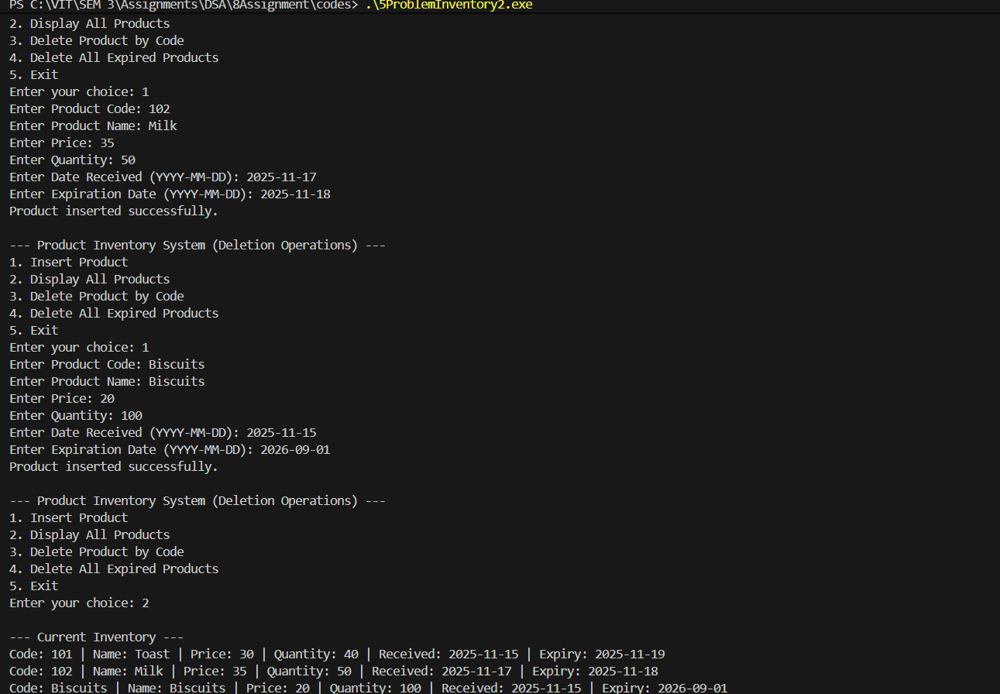
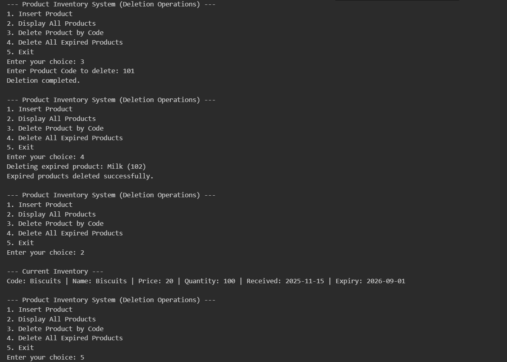

# Assignment No: 8 Problem: 5

## Title: Write a Program to Implement Deletion Operations in the Product Inventory System Using a Search Tree

### Theory
A **Binary Search Tree (BST)** is a nonlinear hierarchical data structure in which each node contains a key and links to its left and right child nodes. The key in the left subtree is always smaller than the key in the parent node, and the key in the right subtree is always greater. This property allows efficient searching, insertion, and deletion operations.

Deletion in a BST involves three possible cases:
1. **Deleting a leaf node** – the node is simply removed.
2. **Deleting a node with one child** – the node is replaced by its child.
3. **Deleting a node with two children** – the node is replaced with its inorder successor (the smallest node in the right subtree), and then the successor is deleted.

Traversal operations such as inorder traversal are used to access the nodes in sorted order. BSTs provide an average time complexity of O(log n) for search, insertion, and deletion, making them suitable for applications that require dynamic and ordered data management.

---

### Algorithm

#### Algorithm: Delete Node by Key
1. If tree is empty, return null.  
2. Compare key with the current node’s key.  
3. If key is smaller, move to left subtree.  
4. If key is larger, move to right subtree.  
5. If key matches:  
   - If node has no children, delete it.  
   - If node has one child, replace node with child.  
   - If node has two children, find inorder successor and replace node’s key with successor’s key.  
6. Return the updated node pointer.

#### Algorithm: Delete Nodes Based on Condition
1. Traverse the left subtree recursively.  
2. Traverse the right subtree recursively.  
3. Check the given condition on the current node.  
4. If condition is satisfied, delete the node using the delete-by-key algorithm.  
5. Return the updated root pointer.

---

### C++ Code
```cpp
#include <iostream>
#include <string>
#include <ctime>
using namespace std;

// Structure for Product node
struct Product_asr {
    string code_asr, name_asr, date_received_asr, expiry_date_asr;
    float price_asr;
    int quantity_asr;
    Product_asr *left_asr, *right_asr;

    Product_asr(string c_asr, string n_asr, float p_asr, int q_asr, string dr_asr, string ed_asr) {
        code_asr = c_asr;
        name_asr = n_asr;
        price_asr = p_asr;
        quantity_asr = q_asr;
        date_received_asr = dr_asr;
        expiry_date_asr = ed_asr;
        left_asr = right_asr = nullptr;
    }
};

// Convert "YYYY-MM-DD" to time_t
time_t convertToTime_asr(string date_asr) {
    tm t = {};
    sscanf(date_asr.c_str(), "%d-%d-%d", &t.tm_year, &t.tm_mon, &t.tm_mday);
    t.tm_year -= 1900;
    t.tm_mon -= 1;
    return mktime(&t);
}

// Insert product based on Product Code
Product_asr* insertProduct_asr(Product_asr* root_asr, string code_asr, string name_asr,
                               float price_asr, int qty_asr, string dr_asr, string ed_asr) {
    if (root_asr == nullptr)
        return new Product_asr(code_asr, name_asr, price_asr, qty_asr, dr_asr, ed_asr);

    if (code_asr < root_asr->code_asr)
        root_asr->left_asr = insertProduct_asr(root_asr->left_asr, code_asr, name_asr, price_asr, qty_asr, dr_asr, ed_asr);
    else if (code_asr > root_asr->code_asr)
        root_asr->right_asr = insertProduct_asr(root_asr->right_asr, code_asr, name_asr, price_asr, qty_asr, dr_asr, ed_asr);

    return root_asr;
}

// Find minimum node
Product_asr* findMin_asr(Product_asr* root_asr) {
    while (root_asr && root_asr->left_asr != nullptr)
        root_asr = root_asr->left_asr;
    return root_asr;
}

// Delete a product by code
Product_asr* deleteByCode_asr(Product_asr* root_asr, string code_asr) {
    if (root_asr == nullptr)
        return root_asr;

    if (code_asr < root_asr->code_asr)
        root_asr->left_asr = deleteByCode_asr(root_asr->left_asr, code_asr);
    else if (code_asr > root_asr->code_asr)
        root_asr->right_asr = deleteByCode_asr(root_asr->right_asr, code_asr);
    else {
        if (root_asr->left_asr == nullptr) {
            Product_asr* temp = root_asr->right_asr;
            delete root_asr;
            return temp;
        } 
        else if (root_asr->right_asr == nullptr) {
            Product_asr* temp = root_asr->left_asr;
            delete root_asr;
            return temp;
        }

        Product_asr* temp = findMin_asr(root_asr->right_asr);

        root_asr->code_asr = temp->code_asr;
        root_asr->name_asr = temp->name_asr;
        root_asr->price_asr = temp->price_asr;
        root_asr->quantity_asr = temp->quantity_asr;
        root_asr->date_received_asr = temp->date_received_asr;
        root_asr->expiry_date_asr = temp->expiry_date_asr;

        root_asr->right_asr = deleteByCode_asr(root_asr->right_asr, temp->code_asr);
    }

    return root_asr;
}

// Delete all expired products
Product_asr* deleteExpired_asr(Product_asr* root_asr) {
    if (root_asr == nullptr)
        return nullptr;

    root_asr->left_asr = deleteExpired_asr(root_asr->left_asr);
    root_asr->right_asr = deleteExpired_asr(root_asr->right_asr);

    time_t now_asr = time(0);
    time_t expDate_asr = convertToTime_asr(root_asr->expiry_date_asr);

    if (difftime(expDate_asr, now_asr) < 0) {
        cout << "Deleting expired product: " << root_asr->name_asr 
             << " (" << root_asr->code_asr << ")\n";

        root_asr = deleteByCode_asr(root_asr, root_asr->code_asr);
    }

    return root_asr;
}

// Display products
void inorderDisplay_asr(Product_asr* root_asr) {
    if (root_asr == nullptr)
        return;

    inorderDisplay_asr(root_asr->left_asr);

    cout << "Code: " << root_asr->code_asr
         << " | Name: " << root_asr->name_asr
         << " | Price: " << root_asr->price_asr
         << " | Quantity: " << root_asr->quantity_asr
         << " | Received: " << root_asr->date_received_asr
         << " | Expiry: " << root_asr->expiry_date_asr << endl;

    inorderDisplay_asr(root_asr->right_asr);
}

int main() {
    Product_asr* root_asr = nullptr;
    int choice_asr;
    string code_asr, name_asr, dr_asr, ed_asr;
    float price_asr;
    int qty_asr;

    while (true) {
        cout << "\n--- Product Inventory System (Deletion Operations) ---\n";
        cout << "1. Insert Product\n2. Display All Products\n3. Delete Product by Code\n4. Delete All Expired Products\n5. Exit\n";
        cout << "Enter your choice: ";
        cin >> choice_asr;

        switch (choice_asr) {
            case 1:
                cout << "Enter Product Code: ";
                cin >> code_asr;
                cout << "Enter Product Name: ";
                cin.ignore();
                getline(cin, name_asr);
                cout << "Enter Price: ";
                cin >> price_asr;
                cout << "Enter Quantity: ";
                cin >> qty_asr;
                cout << "Enter Date Received (YYYY-MM-DD): ";
                cin >> dr_asr;
                cout << "Enter Expiration Date (YYYY-MM-DD): ";
                cin >> ed_asr;
                root_asr = insertProduct_asr(root_asr, code_asr, name_asr, price_asr, qty_asr, dr_asr, ed_asr);
                cout << "Product inserted successfully.\n";
                break;

            case 2:
                cout << "\n--- Current Inventory ---\n";
                inorderDisplay_asr(root_asr);
                break;

            case 3:
                cout << "Enter Product Code to delete: ";
                cin >> code_asr;
                root_asr = deleteByCode_asr(root_asr, code_asr);
                cout << "Deletion completed.\n";
                break;

            case 4:
                root_asr = deleteExpired_asr(root_asr);
                cout << "Expired products deleted successfully.\n";
                break;

            case 5:
                cout << "Exiting program.\n";
                return 0;

            default:
                cout << "Invalid choice. Try again.\n";
        }
    }
}
```

### Output

```
--- Product Inventory System (Deletion Operations) ---
1. Insert Product
2. Display All Products
3. Delete Product by Code
4. Delete All Expired Products
5. Exit
Enter your choice: 1
Enter Product Code: 101
Enter Product Name: Toast
Enter Price: 30
Enter Quantity: 40 
Enter Date Received (YYYY-MM-DD): 2025-11-15
Enter Expiration Date (YYYY-MM-DD): 2025-11-19
Product inserted successfully.

--- Product Inventory System (Deletion Operations) ---
1. Insert Product
2. Display All Products
3. Delete Product by Code
4. Delete All Expired Products
5. Exit
Enter your choice: 1
Enter Product Code: 102
Enter Product Name: Milk
Enter Price: 35
Enter Quantity: 50
Enter Date Received (YYYY-MM-DD): 2025-11-17
Enter Expiration Date (YYYY-MM-DD): 2025-11-18
Product inserted successfully.

--- Product Inventory System (Deletion Operations) ---
1. Insert Product
2. Display All Products
3. Delete Product by Code
4. Delete All Expired Products
5. Exit
Enter your choice: 1
Enter Product Code: Biscuits
Enter Product Name: Biscuits
Enter Price: 20
Enter Quantity: 100
Enter Date Received (YYYY-MM-DD): 2025-11-15
Enter Expiration Date (YYYY-MM-DD): 2026-09-01
Product inserted successfully.

--- Product Inventory System (Deletion Operations) ---
1. Insert Product
2. Display All Products
3. Delete Product by Code
4. Delete All Expired Products
5. Exit
Enter your choice: 2

--- Current Inventory ---
Code: 101 | Name: Toast | Price: 30 | Quantity: 40 | Received: 2025-11-15 | Expiry: 2025-11-19
Code: 102 | Name: Milk | Price: 35 | Quantity: 50 | Received: 2025-11-17 | Expiry: 2025-11-18
Code: Biscuits | Name: Biscuits | Price: 20 | Quantity: 100 | Received: 2025-11-15 | Expiry: 2026-09-01

--- Product Inventory System (Deletion Operations) ---
1. Insert Product
2. Display All Products
3. Delete Product by Code
4. Delete All Expired Products
5. Exit
Enter your choice: 3
Enter Product Code to delete: 101
Deletion completed.

--- Product Inventory System (Deletion Operations) ---
1. Insert Product
2. Display All Products
3. Delete Product by Code
4. Delete All Expired Products
5. Exit
Enter your choice: 4
Deleting expired product: Milk (102)
Expired products deleted successfully.

--- Product Inventory System (Deletion Operations) ---
1. Insert Product
2. Display All Products
3. Delete Product by Code
4. Delete All Expired Products
5. Exit
Enter your choice: 2

--- Current Inventory ---
Code: Biscuits | Name: Biscuits | Price: 20 | Quantity: 100 | Received: 2025-11-15 | Expiry: 2026-09-01

--- Product Inventory System (Deletion Operations) ---
1. Insert Product
2. Display All Products
3. Delete Product by Code
4. Delete All Expired Products
5. Exit
Enter your choice: 5
Exiting program.

```




