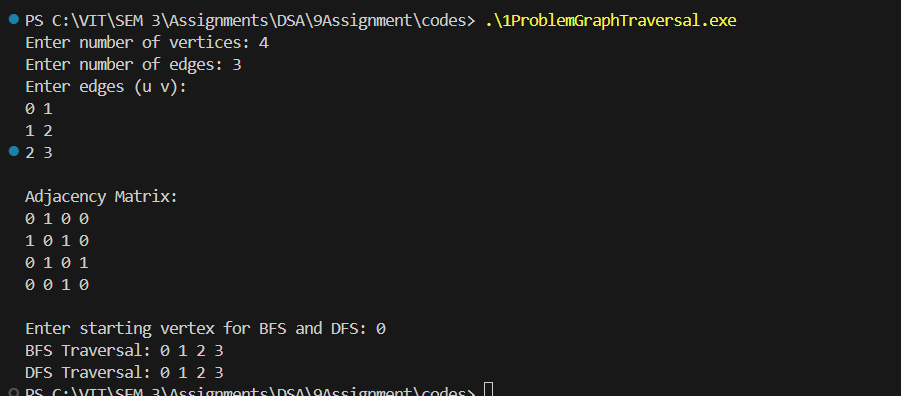

# Assignment No: 9 Problem: 1

## Title: Write a Program to Accept a Graph from the User, Represent It Using an Adjacency Matrix, and Perform BFS & DFS Traversals


### Theory

Graph traversal is a fundamental operation in graph theory and computer science.  
In this assignment, a graph is represented using an **Adjacency Matrix**, which is a 2D array where:

- `matrix[i][j] = 1` indicates an edge exists between vertex `i` and vertex `j`  
- `matrix[i][j] = 0` indicates no edge  

Two major traversal techniques are used:

#### **Breadth-First Search (BFS)**
- Traverses level by level  
- Uses a **queue**  
- Suitable for shortest path in unweighted graphs  

#### **Depth-First Search (DFS)**
- Traverses deep before backtracking  
- Uses **recursion**  
- Useful for cycle detection and path exploring  

---

### Algorithm

#### **Algorithm for Creating Adjacency Matrix**
1. Start  
2. Accept number of vertices `n`  
3. Initialize an `n × n` matrix with all zeros  
4. Accept number of edges `e`  
5. For each edge:  
   - Accept vertices `u`, `v`  
   - Set `matrix[u][v] = 1`  
   - Set `matrix[v][u] = 1`  
6. Stop  

---

#### **Algorithm for BFS Traversal**
1. Start  
2. Initialize visited array to 0  
3. Create an empty queue  
4. Insert starting vertex and mark visited  
5. Repeat while queue is not empty:  
   - Remove front vertex  
   - Display it  
   - For each adjacent vertex:  
     - If not visited, insert and mark visited  
6. Stop  

---

#### **Algorithm for DFS Traversal**
1. Start  
2. Initialize visited array to 0  
3. Call DFS function with starting vertex  
4. Inside DFS function:  
   - Mark current vertex visited  
   - Display current vertex  
   - For each adjacent vertex:  
     - If not visited, call DFS recursively  
5. Stop  

---

### C++ Code

```cpp
#include <iostream>
#include <queue>
using namespace std;

struct Graph_asr {
    int vertices_asr;
    int **adj_asr;
};

// Create graph
Graph_asr* createGraph_asr(int vertices_asr) {
    Graph_asr* graph_asr = new Graph_asr();
    graph_asr->vertices_asr = vertices_asr;

    graph_asr->adj_asr = new int*[vertices_asr];
    for (int i_asr = 0; i_asr < vertices_asr; i_asr++) {
        graph_asr->adj_asr[i_asr] = new int[vertices_asr];
        for (int j_asr = 0; j_asr < vertices_asr; j_asr++) {
            graph_asr->adj_asr[i_asr][j_asr] = 0;
        }
    }
    return graph_asr;
}
// Add edge
void addEdge_asr(Graph_asr* graph_asr, int u_asr, int v_asr) {
    graph_asr->adj_asr[u_asr][v_asr] = 1;
    graph_asr->adj_asr[v_asr][u_asr] = 1;  // Undirected
}
// BFS
void BFS_asr(Graph_asr* graph_asr, int start_asr) {
    int visited_asr[100] = {0};
    queue<int> q_asr;

    visited_asr[start_asr] = 1;
    q_asr.push(start_asr);

    cout << "BFS Traversal: ";

    while (!q_asr.empty()) {
        int curr_asr = q_asr.front();
        q_asr.pop();
        cout << curr_asr << " ";

        for (int i_asr = 0; i_asr < graph_asr->vertices_asr; i_asr++) {
            if (graph_asr->adj_asr[curr_asr][i_asr] == 1 && !visited_asr[i_asr]) {
                visited_asr[i_asr] = 1;
                q_asr.push(i_asr);
            }
        }
    }
    cout << endl;
}
// DFS Utility
void DFSUtil_asr(Graph_asr* graph_asr, int vertex_asr, int visited_asr[]) {
    visited_asr[vertex_asr] = 1;
    cout << vertex_asr << " ";

    for (int i_asr = 0; i_asr < graph_asr->vertices_asr; i_asr++) {
        if (graph_asr->adj_asr[vertex_asr][i_asr] == 1 && !visited_asr[i_asr]) {
            DFSUtil_asr(graph_asr, i_asr, visited_asr);
        }
    }
}
// DFS
void DFS_asr(Graph_asr* graph_asr, int start_asr) {
    int visited_asr[100] = {0};
    cout << "DFS Traversal: ";
    DFSUtil_asr(graph_asr, start_asr, visited_asr);
    cout << endl;
}

// print Adjacency Matrix
void printAdjacencyMatrix_asr(Graph_asr* graph_asr) {
    cout << "\nAdjacency Matrix:\n";
    for (int i_asr = 0; i_asr < graph_asr->vertices_asr; i_asr++) {
        for (int j_asr = 0; j_asr < graph_asr->vertices_asr; j_asr++) {
            cout << graph_asr->adj_asr[i_asr][j_asr] << " ";
        }
        cout << endl;
    }
}

int main() {
    int vertices_asr, edges_asr;
    cout << "Enter number of vertices: ";
    cin >> vertices_asr;
    Graph_asr* graph_asr = createGraph_asr(vertices_asr);
    cout << "Enter number of edges: ";
    cin >> edges_asr;
    cout << "Enter edges (u v):" << endl;
    for (int i_asr = 0; i_asr < edges_asr; i_asr++) {
        int u_asr, v_asr;
        cin >> u_asr >> v_asr;
        addEdge_asr(graph_asr, u_asr, v_asr);
    }
    printAdjacencyMatrix_asr(graph_asr);
    int start_asr;
    cout << "\nEnter starting vertex for BFS and DFS: ";
    cin >> start_asr;
    BFS_asr(graph_asr, start_asr);
    DFS_asr(graph_asr, start_asr);
    return 0;
}

```

---

### Output

```
Enter number of vertices: 4
Enter number of edges: 3
Enter edges (u v):
0 1
1 2
2 3

Adjacency Matrix:
0 1 0 0 
1 0 1 0 
0 1 0 1 
0 0 1 0 

Enter starting vertex for BFS and DFS: 0
BFS Traversal: 0 1 2 3 
DFS Traversal: 0 1 2 3 

```
