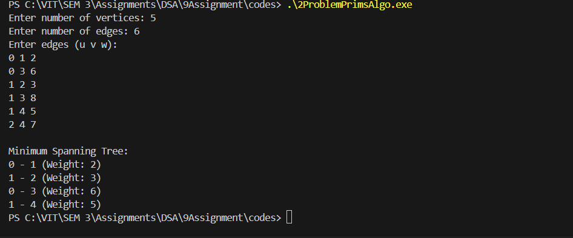

# Assignment No: 9 Problem: 2 

## Title: Implementation of Prim’s Algorithm Using Adjacency List


### Theory

Prim’s algorithm is a greedy algorithm used to find the **Minimum Spanning Tree (MST)** of a connected, undirected, weighted graph.  
The algorithm grows the MST one vertex at a time by selecting the least costly edge that connects a vertex inside the MST to a vertex outside it.

**Key Concepts:**
- An MST connects all vertices with minimum total edge weight.
- Priority queues (min-heaps) help efficiently pick the smallest edge.
- Adjacency List is a memory-efficient representation for sparse graphs.

---

### Algorithm

1. Start by selecting an arbitrary vertex as the initial node and mark it as part of the MST.
2. Initialize an array `key[]` to store the minimum weights needed to include each vertex.
3. Initialize a `parent[]` array to store the MST structure.
4. Insert the starting vertex into a min-priority queue with key value 0.
5. While the priority queue is not empty:
   - Extract the vertex with the smallest key value.
   - For each adjacent vertex:
     - If the edge weight is smaller than the current key value and the vertex is not yet in the MST, update:
       - Its key value
       - Its parent
       - Insert or update it in the priority queue
6. Once completed, the `parent[]` array represents the MST.

---

### C++ Code

```cpp
#include <iostream>
#include <vector>
#include <queue>
#include <climits>
using namespace std;

struct Edge_asr {
    int to_asr;
    int weight_asr;
};

struct Node_asr {
    int vertex_asr;
    int key_asr;
    bool operator>(const Node_asr &other_asr) const {
        return key_asr > other_asr.key_asr;
    }
};

int main() {
    int vertices_asr, edges_asr;
    cout << "Enter number of vertices: ";
    cin >> vertices_asr;

    cout << "Enter number of edges: ";
    cin >> edges_asr;

    vector<vector<Edge_asr>> adjList_asr(vertices_asr);

    cout << "Enter edges (u v w):\n";
    for (int i = 0; i < edges_asr; i++) {
        int u_asr, v_asr, w_asr;
        cin >> u_asr >> v_asr >> w_asr;
        adjList_asr[u_asr].push_back({v_asr, w_asr});
        adjList_asr[v_asr].push_back({u_asr, w_asr});
    }

    vector<int> key_asr(vertices_asr, INT_MAX);
    vector<bool> inMST_asr(vertices_asr, false);
    vector<int> parent_asr(vertices_asr, -1);

    priority_queue<Node_asr, vector<Node_asr>, greater<Node_asr>> pq_asr;

    key_asr[0] = 0;
    pq_asr.push({0, 0});

    while (!pq_asr.empty()) {
        int u_asr = pq_asr.top().vertex_asr;
        pq_asr.pop();

        if (inMST_asr[u_asr]) continue;
        inMST_asr[u_asr] = true;

        for (auto &edge_asr : adjList_asr[u_asr]) {
            int v_asr = edge_asr.to_asr;
            int w_asr = edge_asr.weight_asr;

            if (!inMST_asr[v_asr] && w_asr < key_asr[v_asr]) {
                key_asr[v_asr] = w_asr;
                parent_asr[v_asr] = u_asr;
                pq_asr.push({v_asr, key_asr[v_asr]});
            }
        }
    }

    cout << "\nMinimum Spanning Tree:\n";
    for (int i = 1; i < vertices_asr; i++) {
        cout << parent_asr[i] << " - " << i << " (Weight: " << key_asr[i] << ")\n";
    }

    return 0;
}
```

### Output

```
Enter number of vertices: 5
Enter number of edges: 6
Enter edges (u v w):
0 1 2
0 3 6
1 2 3
1 3 8
1 4 5
2 4 7

Minimum Spanning Tree:
0 - 1 (Weight: 2)
1 - 2 (Weight: 3)
0 - 3 (Weight: 6)
1 - 4 (Weight: 5)
```

