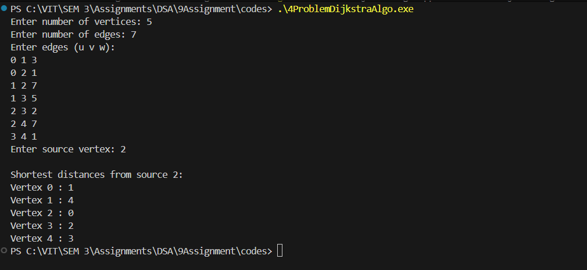

# Assignment No: 9 Problem: 4

## Title: Write a Program to Implement Dijkstra’s Algorithm Using an Adjacency List


### Theory

Dijkstra’s algorithm is a greedy algorithm used to compute the shortest path from a single source node to all other nodes in a weighted graph with non-negative edge weights. It works by iteratively selecting the unvisited node with the smallest known distance, updating the distances of its neighboring nodes, and marking it as visited.

The graph is represented using an **Adjacency List**, where each node stores a list of its connected edges along with their respective weights. This representation is memory-efficient and preferred for sparse graphs. A priority queue (min-heap) is typically used to efficiently retrieve the next node with the minimum distance.

---

### Algorithm

1. Start  
2. Input number of vertices and edges  
3. Initialize an adjacency list for the graph  
4. For each edge, insert the pair (neighbor, weight) into the adjacency list  
5. Take source node as input  
6. Initialize distance array with infinity and visited array with false  
7. Set the distance of the source node to 0  
8. Insert the source node into a priority queue  
9. While the priority queue is not empty  
   - Extract the node with the smallest distance  
   - If the node is already visited, continue  
   - Mark the node as visited  
   - For every adjacent node  
     - If a shorter path is found, update the distance  
     - Push updated pair (distance, node) into the priority queue  
10. Output the final shortest distances  
11. Stop  

---

### C++ Code

```cpp
#include <iostream>
#include <vector>
#include <queue>
#include <climits>

using namespace std;

// Structure for storing graph edges
struct Edge_asr {
    int vertex_asr;
    int weight_asr;
};

// Structure for priority queue nodes
struct Node_asr {
    int vertex_asr;
    int dist_asr;
};

// Custom comparator
struct Compare_asr {
    bool operator()(Node_asr const &a_asr, Node_asr const &b_asr) {
        return a_asr.dist_asr > b_asr.dist_asr;
    }
};

int main() {
    int vertices_asr, edges_asr;
    cout << "Enter number of vertices: ";
    cin >> vertices_asr;

    cout << "Enter number of edges: ";
    cin >> edges_asr;

    vector<vector<Edge_asr>> adj_asr(vertices_asr);

    cout << "Enter edges (u v w):\n";
    for(int i_asr = 0; i_asr < edges_asr; i_asr++) {
        int u_asr, v_asr, w_asr;
        cin >> u_asr >> v_asr >> w_asr;

        Edge_asr edge1_asr = {v_asr, w_asr};
        adj_asr[u_asr].push_back(edge1_asr);

        Edge_asr edge2_asr = {u_asr, w_asr}; // For undirected graph
        adj_asr[v_asr].push_back(edge2_asr);
    }

    int source_asr;
    cout << "Enter source vertex: ";
    cin >> source_asr;

    vector<int> dist_asr(vertices_asr, INT_MAX);
    vector<bool> visited_asr(vertices_asr, false);

    priority_queue<Node_asr, vector<Node_asr>, Compare_asr> pq_asr;

    dist_asr[source_asr] = 0;

    pq_asr.push({source_asr, 0});

    while(!pq_asr.empty()) {
        Node_asr top_asr = pq_asr.top();
        pq_asr.pop();

        int u_asr = top_asr.vertex_asr;

        if(visited_asr[u_asr]) {
            continue;
        }

        visited_asr[u_asr] = true;

        for(auto edge_asr : adj_asr[u_asr]) {
            int v_asr = edge_asr.vertex_asr;
            int weight_asr = edge_asr.weight_asr;

            if(dist_asr[u_asr] + weight_asr < dist_asr[v_asr]) {
                dist_asr[v_asr] = dist_asr[u_asr] + weight_asr;
                pq_asr.push({v_asr, dist_asr[v_asr]});
            }
        }
    }

    cout << "\nShortest distances from source " << source_asr << ":\n";
    for(int i_asr = 0; i_asr < vertices_asr; i_asr++) {
        cout << "Vertex " << i_asr << " : " << dist_asr[i_asr] << endl;
    }

    return 0;
}
```

---

### Output

```
Enter number of vertices: 5
Enter number of edges: 7
Enter edges (u v w):
0 1 3
0 2 1
1 2 7
1 3 5
2 3 2
2 4 7
3 4 1
Enter source vertex: 2

Shortest distances from source 2:
Vertex 0 : 1
Vertex 1 : 4
Vertex 2 : 0
Vertex 3 : 2
Vertex 4 : 3

```


