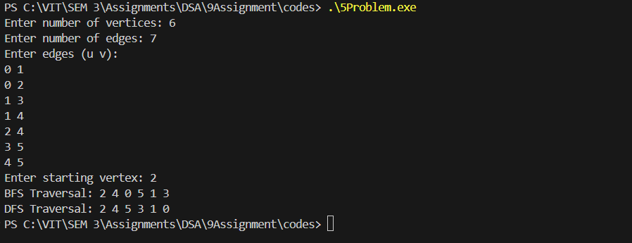

# Assignment No: 9 Problem: 5
## Title: Graph Representation and Traversal Using Adjacency List


### Theory

Graphs are a fundamental data structure in computer science used to represent relationships between objects. A graph consists of nodes (vertices) and edges connecting them. Graphs can be represented in various ways, including adjacency matrices and adjacency lists.

*   **Adjacency List:** A space-efficient way to represent graphs, especially when the graph is sparse. Each vertex stores a list of adjacent vertices.
    
*   **Breadth-First Search (BFS):** Explores nodes level by level, starting from a source node. Uses a queue data structure.
    
*   **Depth-First Search (DFS):** Explores as far as possible along each branch before backtracking. Uses recursion or a stack data structure.
    

### Algorithm

**1\. Graph Representation using Adjacency List:**

1.  Accept number of vertices V and number of edges E.
    
2.  For each edge, input vertices u and v.
    
3.  Add v to the adjacency list of u and u to the adjacency list of v (for undirected graphs).
    

**2\. BFS Traversal:**

1.  Initialize a visited array of size V to false.
    
2.  Initialize a queue and enqueue the starting vertex.
    
3.  Mark the starting vertex as visited.
    
4.  While the queue is not empty:
    
    *   Dequeue a vertex v.
        
    *   Print v.
        
    *   For each adjacent vertex u of v:
        
        *   If u is not visited, enqueue u and mark it visited.
            

**3\. DFS Traversal (Recursive):**

1.  Initialize a visited array of size V to false.
    
2.  For the starting vertex v:
    
    *   Print v and mark it visited.
        
    *   For each adjacent vertex u of v:
        
        *   If u is not visited, recursively call DFS for u.
            


---

### C++ Code

```cpp
#include <iostream>
#include <vector>
#include <queue>
using namespace std;

// Structure for graph node
struct GraphNode_asr {
    int vertex_asr;
    GraphNode_asr* next_asr;
};

// Function to create a new graph node
GraphNode_asr* createNode_asr(int vertex_asr) {
    GraphNode_asr* node_asr = new GraphNode_asr();
    node_asr->vertex_asr = vertex_asr;
    node_asr->next_asr = nullptr;
    return node_asr;
}

// Function to add edge to the adjacency list
void addEdge_asr(vector<GraphNode_asr*>& adjList_asr, int u_asr, int v_asr) {
    GraphNode_asr* node_asr = createNode_asr(v_asr);
    node_asr->next_asr = adjList_asr[u_asr];
    adjList_asr[u_asr] = node_asr;

    node_asr = createNode_asr(u_asr); // For undirected graph
    node_asr->next_asr = adjList_asr[v_asr];
    adjList_asr[v_asr] = node_asr;
}

// BFS traversal
void BFS_asr(vector<GraphNode_asr*>& adjList_asr, int start_asr, int V_asr) {
    vector<bool> visited_asr(V_asr, false);
    queue<int> q_asr;
    visited_asr[start_asr] = true;
    q_asr.push(start_asr);

    cout << "BFS Traversal: ";
    while(!q_asr.empty()) {
        int v_asr = q_asr.front();
        q_asr.pop();
        cout << v_asr << " ";

        GraphNode_asr* temp_asr = adjList_asr[v_asr];
        while(temp_asr) {
            if(!visited_asr[temp_asr->vertex_asr]) {
                visited_asr[temp_asr->vertex_asr] = true;
                q_asr.push(temp_asr->vertex_asr);
            }
            temp_asr = temp_asr->next_asr;
        }
    }
    cout << endl;
}

// DFS traversal
void DFSUtil_asr(vector<GraphNode_asr*>& adjList_asr, int v_asr, vector<bool>& visited_asr) {
    visited_asr[v_asr] = true;
    cout << v_asr << " ";

    GraphNode_asr* temp_asr = adjList_asr[v_asr];
    while(temp_asr) {
        if(!visited_asr[temp_asr->vertex_asr]) {
            DFSUtil_asr(adjList_asr, temp_asr->vertex_asr, visited_asr);
        }
        temp_asr = temp_asr->next_asr;
    }
}

void DFS_asr(vector<GraphNode_asr*>& adjList_asr, int start_asr, int V_asr) {
    vector<bool> visited_asr(V_asr, false);
    cout << "DFS Traversal: ";
    DFSUtil_asr(adjList_asr, start_asr, visited_asr);
    cout << endl;
}

int main() {
    int V_asr, E_asr;
    cout << "Enter number of vertices: ";
    cin >> V_asr;
    cout << "Enter number of edges: ";
    cin >> E_asr;

    vector<GraphNode_asr*> adjList_asr(V_asr, nullptr);

    cout << "Enter edges (u v):" << endl;
    for(int i = 0; i < E_asr; i++) {
        int u_asr, v_asr;
        cin >> u_asr >> v_asr;
        addEdge_asr(adjList_asr, u_asr, v_asr);
    }

    int start_asr;
    cout << "Enter starting vertex: ";
    cin >> start_asr;

    BFS_asr(adjList_asr, start_asr, V_asr);
    DFS_asr(adjList_asr, start_asr, V_asr);

    return 0;
}


```

### Output
```
Enter number of vertices: 6
Enter number of edges: 7
Enter edges (u v):
0 1
0 2
1 3
1 4
2 4
3 5
4 5
Enter starting vertex: 2
BFS Traversal: 2 4 0 5 1 3 
DFS Traversal: 2 4 5 3 1 0
```
